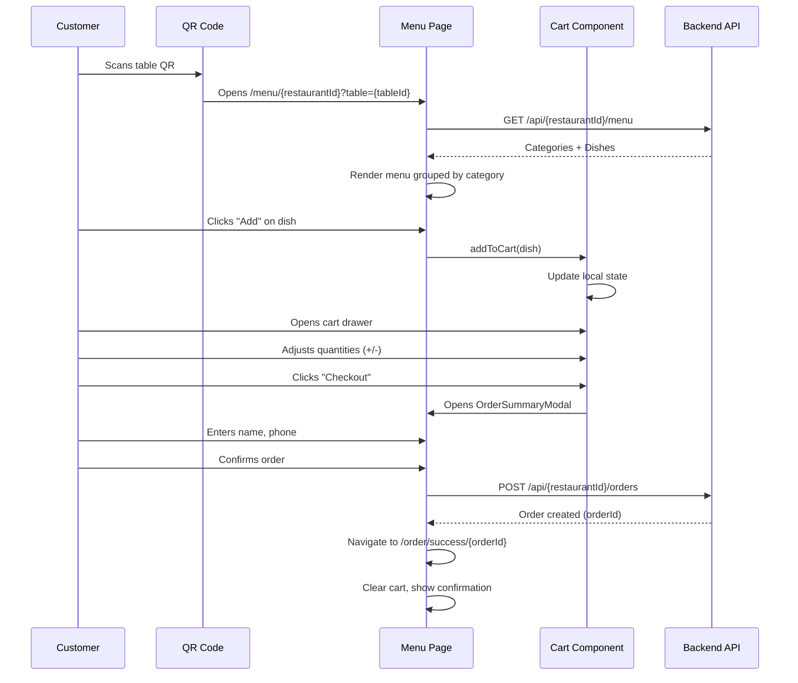
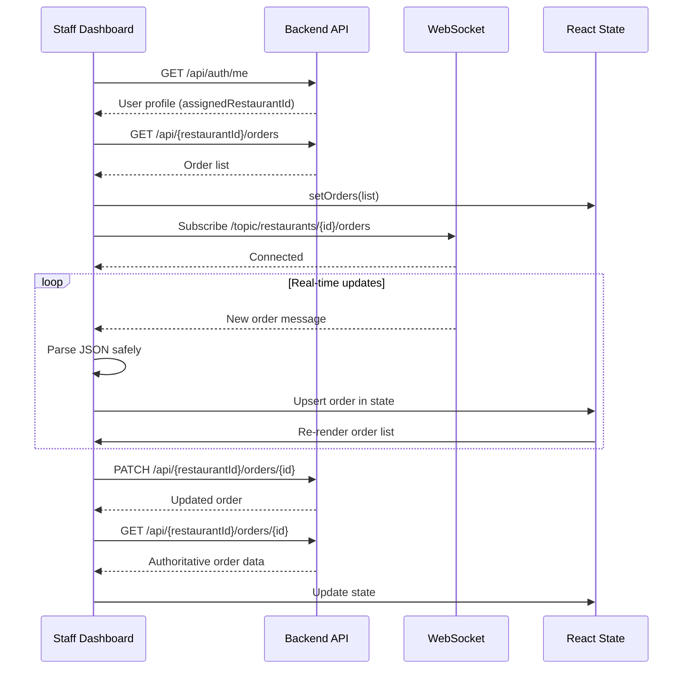
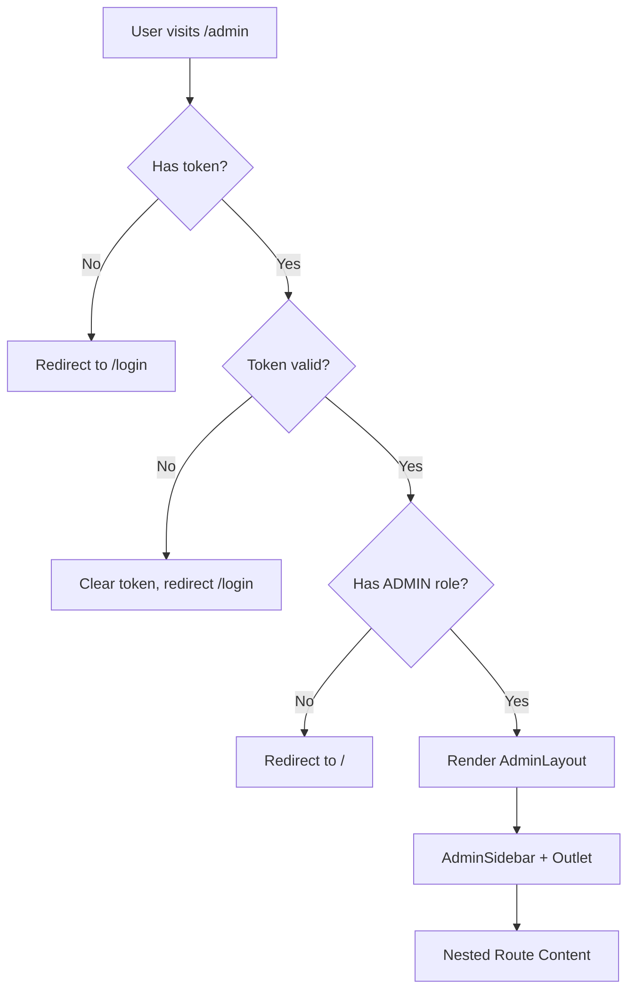
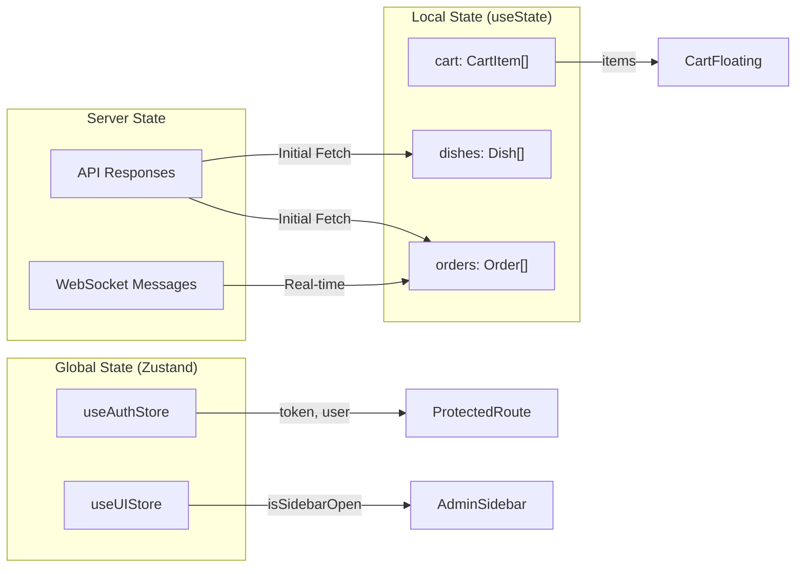

# QuickMenu Frontend - Comprehensive Interview Guide 🖥️

> **Purpose**: An exhaustive, interview-focused deep dive into the QuickMenu frontend codebase. This guide covers React architecture, state management, real-time features, design patterns, and critical interview questions.

---

## Table of Contents

1. [Project Summary](#1-project-summary)
2. [Modules and Logic Breakdown](#2-modules-and-logic-breakdown)
3. [Main Components (Interview Focus)](#3-main-components-interview-focus)
4. [Design Patterns Used](#4-design-patterns-used)
5. [Mock Interview Questions and Answers](#5-mock-interview-questions-and-answers)
6. [Detailed Project Process and Flow Layout](#6-detailed-project-process-and-flow-layout)
7. [Critical Interview Questions (Deep Dive)](#7-critical-interview-questions-deep-dive)
8. [Advanced Critical Interview Questions (Grilling Deep-Dive)](#8-advanced-critical-interview-questions-grilling-deep-dive)

---

## 1. Project Summary

### What Does the Frontend Do?

The QuickMenu frontend is a **React 19 SPA** that provides three distinct user experiences:

| User Type | Experience |
|-----------|------------|
| **Customer** | Scan QR → View menu → Add to cart → Place order → Track status |
| **Staff** | Real-time dashboard with live order/bell notifications via WebSocket |
| **Admin** | Multi-restaurant management, analytics, staff management, settings |

### Tech Stack Overview

| Technology | Version | Purpose |
|------------|---------|---------|
| **React** | 19.2.0 | UI library with new concurrent features |
| **TypeScript** | 5.9.x | Type safety |
| **Vite** | 7.2.2 | Fast build tool with HMR |
| **TailwindCSS** | 3.4.x | Utility-first styling |
| **Zustand** | 5.0.8 | Lightweight state management |
| **React Router** | 7.9.6 | Client-side routing |
| **Axios** | 1.13.x | HTTP client with interceptors |
| **@stomp/stompjs** | 7.2.1 | STOMP protocol for WebSocket |
| **SockJS** | 1.6.1 | WebSocket fallback |
| **Recharts** | 3.6.0 | Charts for analytics |
| **Lucide React** | 0.562 | Icon library |
| **QRCode** | 1.5.4 | QR code generation |

### Project Structure

```
frontend/src/
├── app/
│   └── store.ts           # Zustand stores (auth, UI)
├── components/
│   ├── ui/                # Reusable UI primitives (Button, Input)
│   ├── CartFloating.tsx   # Floating cart drawer
│   ├── DishCard.tsx       # Menu item display
│   ├── NavBar.tsx         # Top navigation
│   ├── AdminSidebar.tsx   # Admin navigation
│   ├── ProtectedRoutes.tsx  # Auth guard HOC
│   └── ...
├── hooks/
│   └── useStomp.ts        # WebSocket hook
├── layouts/
│   └── AdminLayout.tsx    # Admin page wrapper
├── lib/
│   ├── api.ts             # Axios instance
│   ├── jwt.ts             # Token decoding
│   ├── orderStorage.ts    # LocalStorage helpers
│   └── constants.ts       # App constants
├── pages/
│   ├── Admin/             # 14 admin pages
│   ├── Auth/              # Login, Signup, Password reset
│   ├── Landing/           # Landing page sections
│   ├── Menu/              # Restaurant menu
│   ├── Order/             # Order success
│   ├── Staff/             # Staff dashboard
│   └── Public/            # Public restaurant page
└── routes/
    └── AppRoutes.tsx      # All route definitions
```

---

## 2. Modules and Logic Breakdown

### 2.1 Routing ([src/routes/AppRoutes.tsx](file:///c:/Users/syntronic/Desktop/Sohail%20Resume%20Project/QuickMenu/frontend/src/routes/AppRoutes.tsx))

#### Route Structure

```tsx
<Routes>
  {/* Public Routes */}
  <Route path="/" element={<LandingPage />} />
  <Route path="/menu/:restaurantId" element={<RestaurantMenu />} />
  <Route path="/r/:restaurantId" element={<RestaurantLanding />} />
  
  {/* Public-Only (redirect if logged in) */}
  <Route path="/login" element={<PublicOnlyRoute><Login /></PublicOnlyRoute>} />
  <Route path="/signup" element={<PublicOnlyRoute><Signup /></PublicOnlyRoute>} />
  <Route path="/forgot-password" element={<PublicOnlyRoute><ForgotPassword /></PublicOnlyRoute>} />
  
  {/* Protected Routes */}
  <Route path="/staff" element={
    <ProtectedRoute roles={['ADMIN', 'STAFF']}><StaffDashboard /></ProtectedRoute>
  } />
  
  {/* Admin Nested Routes */}
  <Route path="/admin/*" element={<ProtectedRoute roles={['ADMIN']}><AdminLayout /></ProtectedRoute>}>
    <Route index element={<AdminOverview />} />
    <Route path="restaurants" element={<AdminRestaurants />} />
    <Route path="restaurants/:id" element={<AdminRestaurantDetail />} />
    <Route path="orders" element={<AdminOrders />} />
    <Route path="analytics" element={<AdminAnalytics />} />
    <Route path="dishes" element={<AdminDishList />} />
    <Route path="staff" element={<AdminStaff />} />
    <Route path="settings" element={<AdminSettings />} />
  </Route>
</Routes>
```

#### Route Guards

**ProtectedRoute**: Checks authentication and role
```tsx
export default function ProtectedRoute({ children, roles }: Props) {
  const token = useAuthStore((s) => s.token);
  const user = useAuthStore((s) => s.user);

  if (!token) return <Navigate to="/login" replace />;

  if (roles && roles.length > 0) {
    const userRole = user?.role;
    const ok = roles.some(r => userRole === r || userRole === `ROLE_${r}`);
    if (!ok) return <Navigate to="/" replace />;
  }

  return children;
}
```

**PublicOnlyRoute**: Redirects authenticated users away
```tsx
export default function PublicOnlyRoute({ children }: Props) {
  const token = useAuthStore((s) => s.token);
  if (token) return <Navigate to="/admin" replace />;
  return children;
}
```

---

### 2.2 State Management ([src/app/store.ts](file:///c:/Users/syntronic/Desktop/Sohail%20Resume%20Project/QuickMenu/frontend/src/app/store.ts))

#### Zustand Stores

**AuthStore**: Authentication state
```tsx
export const useAuthStore = create<AuthState>((set) => {
  const initialToken = localStorage.getItem('qm_token');
  const initialUser = initialToken ? jwtDecode(initialToken) : null;
  
  return {
    token: initialToken,
    user: initialUser,
    setToken: (token) => {
      if (token) {
        localStorage.setItem('qm_token', token);
        const decoded = jwtDecode(token);
        set({ token, user: decoded });
      } else {
        localStorage.removeItem('qm_token');
        set({ token: null, user: null });
      }
    },
    logout: () => {
      localStorage.removeItem('qm_token');
      set({ token: null, user: null });
    },
  };
});
```

**UIStore**: UI state (sidebar toggle)
```tsx
export const useUIStore = create<UIState>((set) => ({
  isSidebarOpen: false,
  toggleSidebar: () => set((state) => ({ isSidebarOpen: !state.isSidebarOpen })),
  closeSidebar: () => set({ isSidebarOpen: false }),
}));
```

> **Interview Point**: Zustand was chosen over Redux for its minimal boilerplate and no need for providers/context wrapping.

---

### 2.3 API Layer ([src/lib/api.ts](file:///c:/Users/syntronic/Desktop/Sohail%20Resume%20Project/QuickMenu/frontend/src/lib/api.ts))

#### Axios Configuration

```tsx
const baseURL = (import.meta.env.VITE_API_BASE_URL ?? 'http://localhost:8080')
  .replace(/\/$/, '');

export const api = axios.create({
  baseURL,
  headers: { 'Content-Type': 'application/json' },
});

// Request interceptor: Attach JWT
api.interceptors.request.use((config) => {
  const token = localStorage.getItem('qm_token');
  if (token && config.headers) {
    config.headers.Authorization = `Bearer ${token}`;
  }
  return config;
});

// Response interceptor: Handle 401
api.interceptors.response.use(
  (res) => res,
  (error) => {
    if (error?.response?.status === 401) {
      localStorage.removeItem('qm_token');
      window.dispatchEvent(new CustomEvent('qm:unauthorized', { detail: { status: 401 } }));
    }
    return Promise.reject(error);
  },
);
```

> **Key Design Decision**: 401 handling does NOT auto-redirect. It clears the token and dispatches a custom event, letting components decide how to handle it.

---

### 2.4 WebSocket Integration ([src/hooks/useStomp.ts](file:///c:/Users/syntronic/Desktop/Sohail%20Resume%20Project/QuickMenu/frontend/src/hooks/useStomp.ts))

#### Custom Hook Architecture

```tsx
export default function useStomp(): StompClientWrapper {
  const clientRef = useRef<Client | null>(null);
  const pendingSubsRef = useRef<Array<{ dest: string; cb: (m: IMessage) => void }>>([]);
  const activeSubsRef = useRef<StompSubscription[]>([]);

  useEffect(() => {
    const baseHttp = import.meta.env.VITE_API_BASE_URL ?? 'http://localhost:8080';
    const sockJsUrl = `${baseHttp}/ws`;

    const client = new Client({
      webSocketFactory: () => new SockJS(sockJsUrl),
      reconnectDelay: 5000,
      heartbeatIncoming: 0,
      heartbeatOutgoing: 20000,
    });

    client.onConnect = () => {
      // Flush pending subscriptions
      pendingSubsRef.current.forEach((s) => {
        const sub = client.subscribe(s.dest, s.cb);
        if (sub) activeSubsRef.current.push(sub);
      });
      pendingSubsRef.current = [];
    };

    client.activate();
    clientRef.current = client;

    return () => {
      activeSubsRef.current.forEach((s) => s.unsubscribe());
      client.deactivate();
    };
  }, []);

  const subscribe = useCallback((destination: string, callback: (msg: IMessage) => void) => {
    const c = clientRef.current;
    if (c?.connected) {
      return c.subscribe(destination, callback);
    } else {
      // Queue for later
      pendingSubsRef.current.push({ dest: destination, cb: callback });
      return null;
    }
  }, []);

  return { isConnected, subscribe, publish, activate, deactivate };
}
```

#### Key Features:
1. **Pending Subscription Queue**: Subscriptions requested before connection are queued
2. **SockJS Fallback**: Works even when pure WebSocket is blocked
3. **Auto-Reconnect**: 5-second delay between reconnection attempts
4. **Heartbeat**: Outgoing heartbeat every 20 seconds
5. **Cleanup**: Proper unsubscription on unmount

---

### 2.5 Page Modules

#### Admin Pages (14 files)
| Page | Purpose |
|------|---------|
| `AdminOverview` | Dashboard summary |
| `AdminRestaurants` | Restaurant list + CRUD |
| `AdminRestaurantDetail` | Single restaurant management |
| `AdminOrders` | Order management with filtering |
| `AdminOrderDetail` | Single order view |
| `AdminAnalytics` | Charts and metrics (Recharts) |
| `AdminDishList` | Menu item management |
| `AdminDishEditor` | Dish create/edit form |
| `AdminCategories` | Category management |
| `AdminTables` | Table management |
| `AdminQrPage` | QR code generation |
| `AdminStaff` | Staff account management |
| `AdminSettings` | Password change, settings |
| `AdminCreateRestaurant` | Restaurant creation wizard |

#### Auth Pages (5 files)
| Page | Purpose |
|------|---------|
| `Login` | Email/password authentication |
| `Signup` | User registration |
| `ForgotPassword` | Request password reset |
| `ResetPassword` | Set new password with token |
| `DemoSelection` | Demo role selection for recruiters |

#### Customer Flow Pages
| Page | Purpose |
|------|---------|
| [RestaurantMenu](file:///c:/Users/syntronic/Desktop/Sohail%20Resume%20Project/QuickMenu/frontend/src/pages/Menu/RestaurantMenu.tsx#23-504) | Browse menu, add to cart, checkout |
| `OrderSuccess` | Post-order confirmation |
| `RestaurantLanding` | Restaurant public page |

---

## 3. Main Components (Interview Focus)

### 3.1 CartFloating Component

**Purpose**: Floating cart drawer at bottom of menu page

```tsx
type CartItem = {
  dishId: string;
  name: string;
  price: number;
  quantity: number;
  note?: string;
};

export default function CartFloating({
  items,
  onCheckout,
  onIncrement,
  onDecrement,
  onRemove,
}: Props) {
  const [isOpen, setIsOpen] = useState(false);
  const total = items.reduce((s, it) => s + it.quantity * it.price, 0);
  const itemCount = items.reduce((s, it) => s + it.quantity, 0);

  if (items.length === 0 && !isOpen) return null;  // Hide when empty

  return (
    <div className="fixed bottom-6 left-1/2 -translate-x-1/2 z-50">
      {/* Drawer Modal */}
      {isOpen && (
        <div className="absolute bottom-full mb-4">
          {/* Cart items with +/- buttons */}
        </div>
      )}
      
      {/* Floating Pill Button */}
      <button onClick={() => setIsOpen(!isOpen)}>
        {itemCount} items • ₹{total.toFixed(2)}
      </button>
    </div>
  );
}
```

**Key Features**:
- Conditional rendering (hidden when empty)
- Derived state (`total`, `itemCount`)
- Callbacks for cart operations
- Animated drawer with Tailwind

---

### 3.2 Staff Dashboard (Real-time)

**Purpose**: Live order and bell management for staff

```tsx
export default function StaffDashboard() {
  const [orders, setOrders] = useState<Order[]>([]);
  const [bells, setBells] = useState<Bell[]>([]);
  const [restaurantId, setRestaurantId] = useState<string | null>(null);
  const stomp = useStomp();

  // 1. Load user profile to get assignedRestaurantId
  useEffect(() => {
    api.get('/api/auth/me').then((res) => {
      setRestaurantId(res.data.assignedRestaurantId);
    });
  }, []);

  // 2. Fetch initial data
  useEffect(() => {
    if (!restaurantId) return;
    fetchOrdersList();
    fetchBellsList();
  }, [restaurantId]);

  // 3. Subscribe to WebSocket topics
  useEffect(() => {
    if (!restaurantId) return;

    stomp.subscribe(`/topic/restaurants/${restaurantId}/orders`, (msg) => {
      const payload = JSON.parse(msg.body);
      setOrders((prev) => {
        const idx = prev.findIndex((o) => o.id === payload.id);
        if (idx >= 0) {
          const copy = [...prev];
          copy[idx] = payload;  // Update existing
          return copy;
        }
        return [payload, ...prev];  // Prepend new
      });
    });

    stomp.subscribe(`/topic/restaurants/${restaurantId}/bells`, (msg) => {
      // Similar upsert logic
    });
  }, [restaurantId]);

  // 4. Action handlers
  async function changeOrderStatus(orderId: string, newStatus: string) {
    await api.patch(`/api/${restaurantId}/orders/${orderId}`, { status: newStatus });
    // Re-fetch for authoritative data
    await fetchOrdersList();
  }
}
```

**Key Patterns**:
- **Upsert Pattern**: WebSocket updates existing items or prepend new ones
- **Authoritative Backend**: Always re-fetch after mutations for source of truth
- **Safe JSON Parsing**: Handle malformed STOMP frames gracefully

---

### 3.3 AdminLayout with Nested Routes

**Purpose**: Consistent layout for all admin pages

```tsx
export default function AdminLayout() {
  return (
    <div className="min-h-[calc(100vh-64px)] bg-gray-50 flex">
      <AdminSidebar />
      <main className="flex-1 p-4 overflow-x-hidden">
        <div className="max-w-7xl mx-auto">
          <Outlet />  {/* Nested route content renders here */}
        </div>
      </main>
    </div>
  );
}
```

> **Interview Point**: Using React Router's `<Outlet />` for nested routes allows shared layout while rendering different child components.

---

## 4. Design Patterns Used

### 4.1 Container/Presentational Pattern

**Container (Smart)**: Handles logic, state, API calls
```tsx
// RestaurantMenu.tsx - Container
export default function RestaurantMenu() {
  const [cart, setCart] = useState<CartItem[]>([]);
  const [dishes, setDishes] = useState([]);
  
  const addToCart = (dish) => { /* logic */ };
  
  return (
    <>
      {dishes.map(d => <DishCard key={d.id} dish={d} onAdd={() => addToCart(d)} />)}
      <CartFloating items={cart} onCheckout={handleCheckout} />
    </>
  );
}
```

**Presentational (Dumb)**: Pure rendering, receives props
```tsx
// DishCard.tsx - Presentational
export default function DishCard({ dish, onAdd }: Props) {
  return (
    <div className="card">
      <h3>{dish.name}</h3>
      <p>₹{dish.price}</p>
      <button onClick={onAdd}>Add</button>
    </div>
  );
}
```

---

### 4.2 Custom Hook Pattern

**Encapsulate Complex Logic**:
```tsx
// useStomp.ts - Encapsulates WebSocket complexity
export default function useStomp(): StompClientWrapper {
  // Connection, subscription queue, cleanup - all hidden
  return { subscribe, publish, isConnected };
}

// Usage in component
const stomp = useStomp();
stomp.subscribe('/topic/orders', callback);
```

---

### 4.3 Higher-Order Component (HOC) Pattern

**Route Protection**:
```tsx
// ProtectedRoute wraps children with auth check
<ProtectedRoute roles={['ADMIN']}>
  <AdminDashboard />
</ProtectedRoute>
```

---

### 4.4 Compound Component Pattern

**AdminLayout + Child Routes**:
```tsx
<Route path="/admin/*" element={<AdminLayout />}>
  <Route index element={<AdminOverview />} />
  <Route path="orders" element={<AdminOrders />} />
</Route>
```

The layout provides structure, children provide content.

---

### 4.5 Render Props Pattern

**Conditional Rendering**:
```tsx
{items.length === 0 && !isOpen ? null : (
  <CartFloating items={items} />
)}
```

---

### 4.6 Optimistic Update Pattern

**Local state update before API confirmation**:
```tsx
// Optimistic: Update UI immediately
setOrders((prev) => prev.map(o => 
  o.id === orderId ? { ...o, status: newStatus } : o
));

// Then sync with backend
await api.patch(`/api/orders/${orderId}`, { status: newStatus });

// Re-fetch for authoritative state
await fetchOrdersList();
```

---

### 4.7 Singleton Pattern (Zustand Store)

```tsx
// Single global store instance
export const useAuthStore = create<AuthState>((set) => ({
  token: null,
  user: null,
  setToken: (token) => { /* ... */ },
}));

// Any component can access same state
const token = useAuthStore((s) => s.token);
```

---

## 5. Mock Interview Questions and Answers

### Beginner Level

#### Q1: What technologies does the frontend use?

**Answer**: 
- **React 19** with TypeScript for type safety
- **Vite** as build tool (faster than CRA)
- **TailwindCSS** for utility-first styling
- **Zustand** for global state (simpler than Redux)
- **React Router 7** for client-side routing
- **Axios** for HTTP with interceptors
- **@stomp/stompjs + SockJS** for real-time WebSocket
- **Recharts** for analytics charts
- **Lucide** for icons

#### Q2: How do you handle authentication?

**Answer**: 
1. User logs in → backend returns JWT
2. Token stored in `localStorage` via Zustand store
3. Axios request interceptor attaches `Authorization: Bearer <token>` header
4. On 401 response, interceptor clears token and dispatches custom event
5. [ProtectedRoute](file:///c:/Users/syntronic/Desktop/Sohail%20Resume%20Project/QuickMenu/frontend/src/components/ProtectedRoutes.tsx#11-35) component checks token existence and user role

#### Q3: How do you decode JWT without a library?

**Answer**: Custom [jwtDecode](file:///c:/Users/syntronic/Desktop/Sohail%20Resume%20Project/QuickMenu/frontend/src/lib/jwt.ts#1-17) function:
```tsx
export function jwtDecode<T>(token: string | null): T | null {
  if (!token) return null;
  const parts = token.split('.');
  if (parts.length < 2) return null;
  const payload = parts[1];
  const padded = payload.padEnd(payload.length + ((4 - (payload.length % 4)) % 4), '=');
  const decoded = atob(padded);
  return JSON.parse(decoded) as T;
}
```
No external library needed - JWT payload is just Base64-encoded JSON.

---

### Intermediate Level

#### Q4: Why Zustand over Redux?

**Answer**:

| Aspect | Redux | Zustand |
|--------|-------|---------|
| **Boilerplate** | High (actions, reducers, store config) | Minimal (single create call) |
| **Provider Required** | Yes (`<Provider store={store}>`) | No |
| **Bundle Size** | ~15KB | ~1KB |
| **DevTools** | Built-in | Available middleware |
| **Learning Curve** | Steep | Very easy |

For QuickMenu's needs (auth + UI state), Zustand is perfect. Redux would be overkill.

#### Q5: How does the WebSocket subscription queue work?

**Answer**: 
```tsx
// If client not connected yet, queue the subscription
if (c?.connected) {
  return c.subscribe(destination, callback);
} else {
  pendingSubsRef.current.push({ dest: destination, cb: callback });
  return null;
}

// When connected, flush the queue
client.onConnect = () => {
  pendingSubsRef.current.forEach((s) => {
    client.subscribe(s.dest, s.cb);
  });
  pendingSubsRef.current = [];
};
```

This ensures subscriptions requested before connection is ready are not lost.

#### Q6: How do you handle real-time order updates?

**Answer**: Staff Dashboard uses the **Upsert Pattern**:
```tsx
stomp.subscribe(`/topic/restaurants/${restaurantId}/orders`, (msg) => {
  const order = JSON.parse(msg.body);
  setOrders((prev) => {
    const idx = prev.findIndex((o) => o.id === order.id);
    if (idx >= 0) {
      // Update existing order
      const copy = [...prev];
      copy[idx] = order;
      return copy;
    }
    // Prepend new order
    return [order, ...prev];
  });
});
```

---

### Advanced Level

#### Q7: How would you optimize the menu page for large menus?

**Answer**:

1. **Virtualization**: Use `react-window` or `react-virtuoso`
   ```tsx
   <FixedSizeList height={600} itemCount={dishes.length} itemSize={100}>
     {({ index }) => <DishCard dish={dishes[index]} />}
   </FixedSizeList>
   ```

2. **Lazy Loading Images**: Native lazy loading or Intersection Observer
   ```tsx
   
   ```

3. **Pagination/Infinite Scroll**: Load categories on demand

4. **Memoization**: Prevent unnecessary re-renders
   ```tsx
   const DishCard = React.memo(({ dish, onAdd }) => { ... });
   ```

#### Q8: How do you prevent memory leaks with WebSocket subscriptions?

**Answer**: 
```tsx
useEffect(() => {
  const sub = stomp.subscribe(topic, callback);
  
  return () => {
    // Cleanup on unmount
    sub?.unsubscribe();
  };
}, [restaurantId]);
```

The [useStomp](file:///c:/Users/syntronic/Desktop/Sohail%20Resume%20Project/QuickMenu/frontend/src/hooks/useStomp.ts#24-171) hook also tracks active subscriptions in `activeSubsRef` and unsubscribes all on client deactivation.

---

## 6. Detailed Project Process and Flow Layout

### 6.1 Customer Order Flow



---

### 6.2 Staff Real-time Dashboard Flow



---

### 6.3 Admin Authentication Flow



---

### 6.4 Component State Flow



---

## 7. Critical Interview Questions (Deep Dive)

### React & Component Architecture

#### Q9: Why use `useRef` for the STOMP client instead of state?

**Answer**:
```tsx
const clientRef = useRef<Client | null>(null);
```

1. **No re-renders**: Changing ref doesn't trigger re-render
2. **Persistent across renders**: Same instance preserved
3. **Mutable**: Can directly mutate `.current`
4. **Cleanup-safe**: Accessible in cleanup function

Using `useState` would cause infinite loops when updating client state inside effect.

---

#### Q10: How do you handle race conditions in the order update flow?

**Answer**:

**Problem**: WebSocket message and API response arrive at same time

**Solution**: Authoritative backend + functional updates
```tsx
// Always use functional update to avoid stale closure
setOrders((prev) => {
  const idx = prev.findIndex((o) => o.id === order.id);
  if (idx >= 0) {
    const copy = [...prev];
    copy[idx] = order;
    return copy;
  }
  return [order, ...prev];
});

// After mutation, re-fetch for authoritative data
await api.patch(`/api/orders/${orderId}`, { status });
await fetchOrdersList();  // Backend is source of truth
```

---

#### Q11: Why dispatch custom event on 401 instead of redirecting?

**Answer**:
```tsx
window.dispatchEvent(new CustomEvent('qm:unauthorized', { detail: { status } }));
```

**Benefits**:
1. **Decoupled**: API module doesn't need router dependency
2. **Flexible**: Components can choose how to handle it
3. **Testable**: No navigation side effects in API layer
4. **Multiple listeners**: Different components can react differently

**Alternative**: Could use Zustand action, but event is more loosely coupled.

---

### Performance

#### Q12: How do you optimize re-renders in the menu page?

**Answer**:

1. **React.memo for dish cards**:
   ```tsx
   const DishCard = React.memo(({ dish, onAdd }) => { ... });
   ```

2. **useCallback for handlers**:
   ```tsx
   const addToCart = useCallback((dish) => {
     setCart(prev => [...prev, dish]);
   }, []);
   ```

3. **Derived state calculation**:
   ```tsx
   // Computed once per render, not in every child
   const total = useMemo(() => 
     cart.reduce((s, it) => s + it.quantity * it.price, 0), 
     [cart]
   );
   ```

4. **Zustand selectors**:
   ```tsx
   // Only re-render when token changes, not entire store
   const token = useAuthStore((s) => s.token);
   ```

---

### State Management

#### Q13: How is cart state managed without global store?

**Answer**: Local component state with prop drilling:

```tsx
// RestaurantMenu.tsx
const [cart, setCart] = useState<CartItem[]>([]);

const addToCart = (dish) => {
  setCart((prev) => {
    const existing = prev.find(i => i.dishId === dish.id);
    if (existing) {
      return prev.map(i => i.dishId === dish.id ? {...i, quantity: i.quantity + 1} : i);
    }
    return [...prev, { dishId: dish.id, name: dish.name, price: dish.price, quantity: 1 }];
  });
};

// Passed down to children
<DishCard onAdd={() => addToCart(dish)} />
<CartFloating items={cart} onIncrement={handleIncrement} />
```

**Why no global store?**
- Cart is page-specific (cleared on navigation)
- No need for persistence across pages
- Simpler mental model

---

### TypeScript

#### Q14: How do you type the STOMP hook return value?

**Answer**:
```tsx
export type StompClientWrapper = {
  isConnected: () => boolean;
  subscribe: (destination: string, callback: (msg: IMessage) => void) => StompSubscription | null;
  publish: (destination: string, body?: any) => void;
  activate: () => void;
  deactivate: () => Promise<void>;
};

export default function useStomp(): StompClientWrapper {
  // Implementation
  return useMemo(() => ({
    isConnected,
    subscribe,
    publish,
    activate,
    deactivate,
  }), [isConnected, subscribe, publish, activate, deactivate]);
}
```

This provides clear contract for consumers.

---

## 8. Advanced Critical Interview Questions (Grilling Deep-Dive) 🔥

### React Internals

#### Q15: Why use `useMemo` for the useStomp return value?

**Answer**:
```tsx
return useMemo(() => ({
  isConnected,
  subscribe,
  publish,
  activate,
  deactivate,
}), [isConnected, subscribe, publish, activate, deactivate]);
```

**Problem**: Without `useMemo`, the hook returns a new object reference every render.

**Impact**: Any consumer using this in a dependency array would trigger infinite loops:
```tsx
// Without useMemo, stomp changes every render → effect runs every render
useEffect(() => {
  stomp.subscribe(topic, callback);
}, [stomp]);  // ❌ Infinite loop
```

**Solution**: `useMemo` ensures same reference if dependencies haven't changed.

---

#### Q16: How do you handle component unmount during async operations?

**Answer**: Using `mountedRef` pattern in Staff Dashboard:
```tsx
const mountedRef = useRef(true);

useEffect(() => {
  mountedRef.current = true;
  return () => {
    mountedRef.current = false;
  };
}, []);

// In async function
async function fetchData() {
  const res = await api.get('/api/data');
  if (!mountedRef.current) return;  // Don't update state if unmounted
  setData(res.data);
}
```

**Why needed?** Setting state on unmounted component causes memory leak warning.

---

### Security

#### Q17: What are the security implications of storing JWT in localStorage?

**Answer**:

| Storage | XSS Risk | CSRF Risk |
|---------|----------|-----------|
| localStorage | ✅ Vulnerable | ❌ Safe |
| httpOnly Cookie | ❌ Safe | ✅ Vulnerable |

**Current Approach**: localStorage with XSS risk

**Mitigations**:
1. **Short token expiry** (1 hour)
2. **Input sanitization** (React auto-escapes)
3. **CSP headers** (prevent inline scripts)
4. **No `dangerouslySetInnerHTML`** usage

**Production Improvement**:
- Use httpOnly cookie for token storage
- Implement refresh token flow
- Add CSRF token for state-changing requests

---

#### Q18: How do you prevent XSS in user-generated content?

**Answer**: React auto-escapes by default:
```tsx
// Safe - automatically escaped
<div>{userInput}</div>

// Dangerous - only use for trusted HTML
<div dangerouslySetInnerHTML={{ __html: untrustedHtml }} />  // ❌ NEVER for user input
```

The QuickMenu frontend doesn't use `dangerouslySetInnerHTML` anywhere, so user inputs (customer name, notes) are automatically safe.

---

### Performance

#### Q19: How would you implement code splitting for the admin section?

**Answer**: React lazy loading:
```tsx
// Current (all loaded upfront)
import AdminAnalytics from '../pages/Admin/AdminAnalytics';

// With code splitting
const AdminAnalytics = React.lazy(() => import('../pages/Admin/AdminAnalytics'));

// In routes
<Route path="analytics" element={
  <Suspense fallback={<div>Loading...</div>}>
    <AdminAnalytics />
  </Suspense>
} />
```

**Benefits**:
- Smaller initial bundle
- Faster first paint for login page
- Admin code only loaded when needed

---

#### Q20: How do you handle image optimization?

**Answer**: Using Cloudinary transformations:
```tsx
// lib/imageUtils.ts
export function getOptimizedUrl(url: string, width = 400) {
  if (!url || !url.includes('cloudinary')) return url;
  // Transform: https://res.cloudinary.com/xxx/image/upload/v123/file.jpg
  // To: https://res.cloudinary.com/xxx/image/upload/w_400,q_auto,f_auto/v123/file.jpg
  return url.replace('/upload/', `/upload/w_${width},q_auto,f_auto/`);
}

// Usage

```

**Transformations**:
- `w_400`: Width resize
- `q_auto`: Automatic quality optimization
- `f_auto`: Automatic format (WebP for supported browsers)

---

### Architecture

#### Q21: How would you add offline support?

**Answer**:

1. **Service Worker for caching**:
   ```js
   // Cache menu data and static assets
   self.addEventListener('fetch', (event) => {
     if (event.request.url.includes('/api/menu')) {
       event.respondWith(cacheFirst(event.request));
     }
   });
   ```

2. **IndexedDB for pending orders**:
   ```tsx
   // If offline, store order locally
   if (!navigator.onLine) {
     await saveToIndexedDB('pendingOrders', order);
     return;
   }
   ```

3. **Sync when online**:
   ```tsx
   window.addEventListener('online', async () => {
     const pending = await getFromIndexedDB('pendingOrders');
     for (const order of pending) {
       await api.post('/api/orders', order);
     }
   });
   ```

---

#### Q22: How do you handle error boundaries?

**Answer**:
```tsx
class ErrorBoundary extends React.Component {
  state = { hasError: false };

  static getDerivedStateFromError(error) {
    return { hasError: true };
  }

  componentDidCatch(error, errorInfo) {
    // Log to error tracking service
    logErrorToService(error, errorInfo);
  }

  render() {
    if (this.state.hasError) {
      return <ErrorFallback onRetry={() => this.setState({ hasError: false })} />;
    }
    return this.props.children;
  }
}

// Usage
<ErrorBoundary>
  <App />
</ErrorBoundary>
```

**Current Status**: Not implemented in QuickMenu. Would be a good production addition.

---

### Testing

#### Q23: How would you test the useStomp hook?

**Answer**:
```tsx
import { renderHook, act } from '@testing-library/react';
import useStomp from './useStomp';

// Mock SockJS and Client
jest.mock('sockjs-client');
jest.mock('@stomp/stompjs');

describe('useStomp', () => {
  it('should queue subscriptions before connection', () => {
    const { result } = renderHook(() => useStomp());
    
    // Subscribe before connected
    const callback = jest.fn();
    result.current.subscribe('/topic/test', callback);
    
    // Should be queued, not active
    expect(result.current.isConnected()).toBe(false);
  });

  it('should flush queue on connect', async () => {
    const { result } = renderHook(() => useStomp());
    
    // Simulate connection
    await act(async () => {
      mockClient.onConnect();
    });
    
    expect(mockClient.subscribe).toHaveBeenCalledWith('/topic/test', expect.any(Function));
  });
});
```

---

#### Q24: How would you test the ProtectedRoute component?

**Answer**:
```tsx
import { render, screen } from '@testing-library/react';
import { MemoryRouter } from 'react-router-dom';
import ProtectedRoute from './ProtectedRoute';
import { useAuthStore } from '../app/store';

// Mock the store
jest.mock('../app/store');

describe('ProtectedRoute', () => {
  it('redirects to login when not authenticated', () => {
    (useAuthStore as jest.Mock).mockImplementation((selector) => 
      selector({ token: null, user: null })
    );

    render(
      <MemoryRouter>
        <ProtectedRoute>
          <div>Protected Content</div>
        </ProtectedRoute>
      </MemoryRouter>
    );

    expect(screen.queryByText('Protected Content')).not.toBeInTheDocument();
  });

  it('renders children when authenticated with correct role', () => {
    (useAuthStore as jest.Mock).mockImplementation((selector) => 
      selector({ token: 'valid-token', user: { role: 'ROLE_ADMIN' } })
    );

    render(
      <MemoryRouter>
        <ProtectedRoute roles={['ADMIN']}>
          <div>Protected Content</div>
        </ProtectedRoute>
      </MemoryRouter>
    );

    expect(screen.getByText('Protected Content')).toBeInTheDocument();
  });
});
```

---

### Bonus: "What Would You Change?"

#### Q25: If you could refactor one thing, what would it be?

**Answer**: **Extract cart logic into a custom hook**

Current:
```tsx
// All cart logic inline in RestaurantMenu.tsx
const [cart, setCart] = useState([]);
const addToCart = (dish) => { /* ... */ };
const handleIncrement = (id) => { /* ... */ };
const handleDecrement = (id) => { /* ... */ };
```

Refactored:
```tsx
// useCart.ts
export function useCart() {
  const [items, setItems] = useState<CartItem[]>([]);
  
  const addItem = useCallback((dish) => { /* ... */ }, []);
  const increment = useCallback((id) => { /* ... */ }, []);
  const decrement = useCallback((id) => { /* ... */ }, []);
  const removeItem = useCallback((id) => { /* ... */ }, []);
  const clear = useCallback(() => setItems([]), []);
  
  const total = useMemo(() => items.reduce(...), [items]);
  const itemCount = useMemo(() => items.reduce(...), [items]);
  
  return { items, addItem, increment, decrement, removeItem, clear, total, itemCount };
}

// Usage
const cart = useCart();
<DishCard onAdd={() => cart.addItem(dish)} />
```

**Benefits**:
- Reusable across pages
- Testable in isolation
- Cleaner component code

---

## Quick Reference Card

### Key Files to Know

| File | Purpose |
|------|---------|
| [src/app/store.ts](file:///c:/Users/syntronic/Desktop/Sohail%20Resume%20Project/QuickMenu/frontend/src/app/store.ts) | Zustand auth + UI stores |
| [src/lib/api.ts](file:///c:/Users/syntronic/Desktop/Sohail%20Resume%20Project/QuickMenu/frontend/src/lib/api.ts) | Axios instance with interceptors |
| [src/hooks/useStomp.ts](file:///c:/Users/syntronic/Desktop/Sohail%20Resume%20Project/QuickMenu/frontend/src/hooks/useStomp.ts) | WebSocket hook |
| [src/routes/AppRoutes.tsx](file:///c:/Users/syntronic/Desktop/Sohail%20Resume%20Project/QuickMenu/frontend/src/routes/AppRoutes.tsx) | All route definitions |
| [src/components/ProtectedRoutes.tsx](file:///c:/Users/syntronic/Desktop/Sohail%20Resume%20Project/QuickMenu/frontend/src/components/ProtectedRoutes.tsx) | Auth guard |
| [src/pages/Staff/Dashboard.tsx](file:///c:/Users/syntronic/Desktop/Sohail%20Resume%20Project/QuickMenu/frontend/src/pages/Staff/Dashboard.tsx) | Real-time order management |
| [src/pages/Menu/RestaurantMenu.tsx](file:///c:/Users/syntronic/Desktop/Sohail%20Resume%20Project/QuickMenu/frontend/src/pages/Menu/RestaurantMenu.tsx) | Customer menu + cart |

### State Management Cheat Sheet

| State Type | Tool | Example |
|------------|------|---------|
| Global (auth) | Zustand | `useAuthStore` |
| Global (UI) | Zustand | `useUIStore` |
| Page-level | useState | cart items, dishes |
| Server cache | useState + useEffect | orders, bells |
| Real-time | useStomp | WebSocket subscriptions |

### Environment Variables

```env
VITE_API_BASE_URL=http://localhost:8080
VITE_WS_BASE_URL=http://localhost:8080
```

---

> **Pro Tip**: When explaining frontend architecture, always highlight:
> 1. **User experience** - why this approach benefits users
> 2. **Performance** - re-render optimization, lazy loading
> 3. **Developer experience** - maintainability, testability
> 4. **Trade-offs** - what was sacrificed and why
