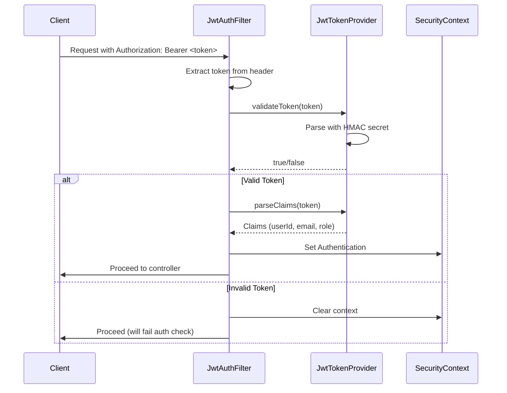
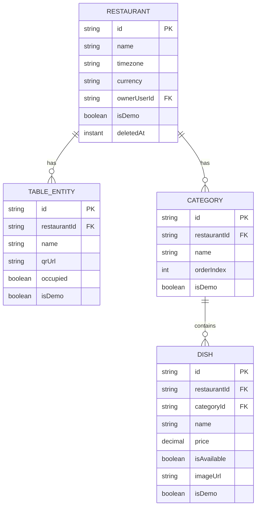
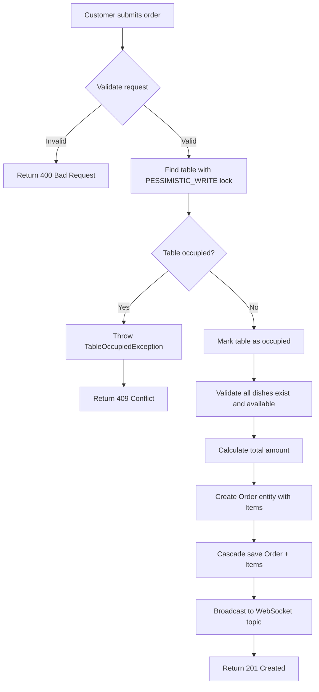
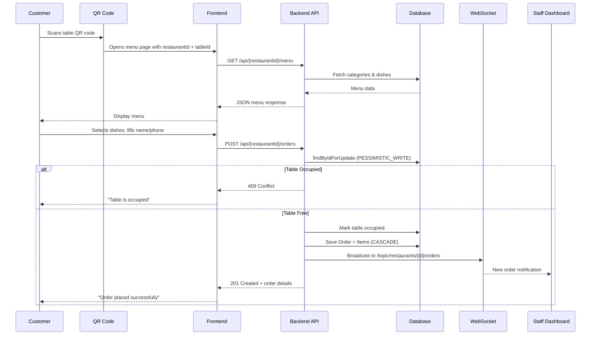
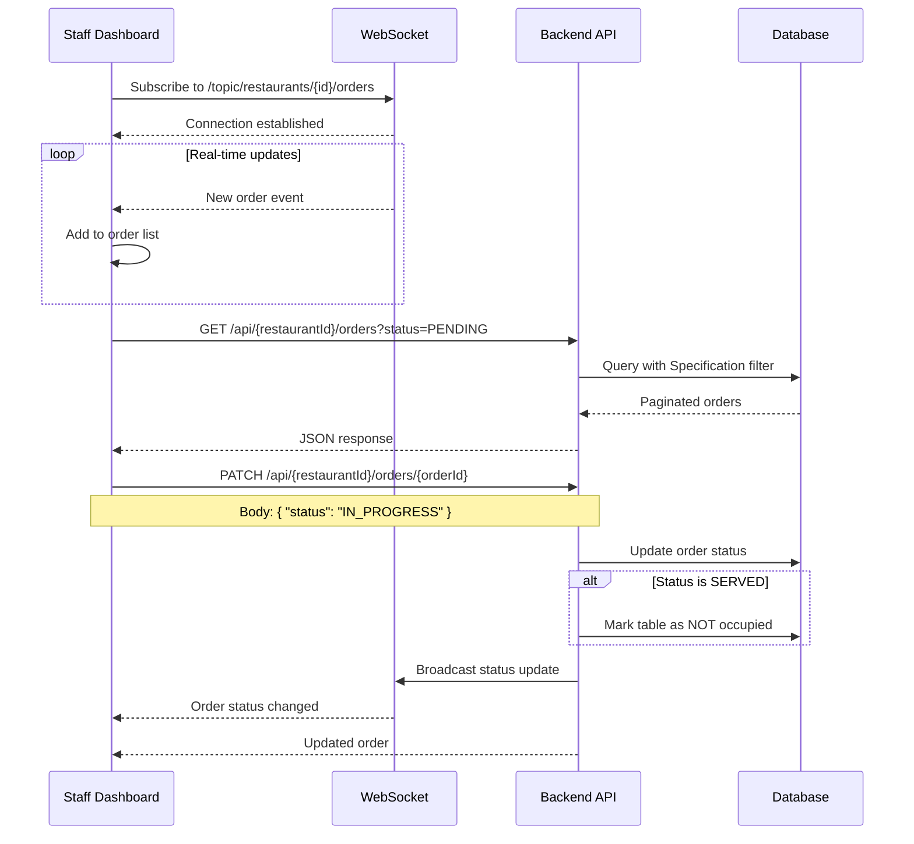
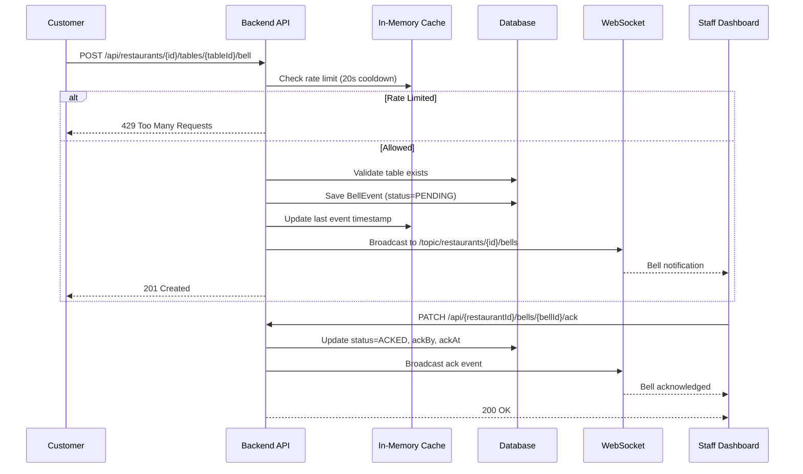
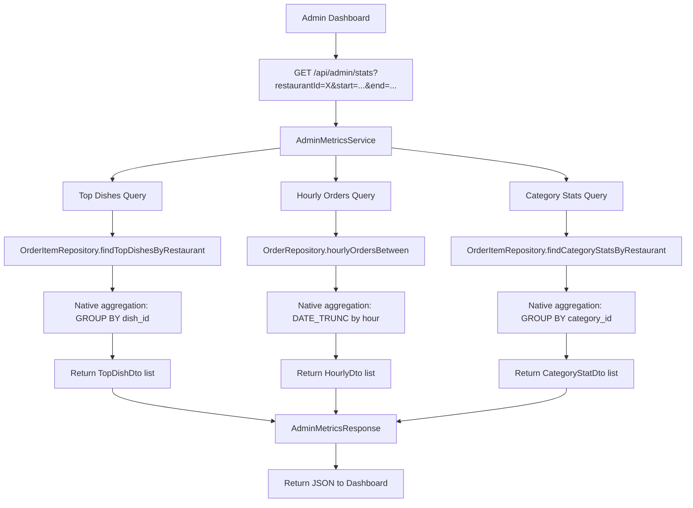
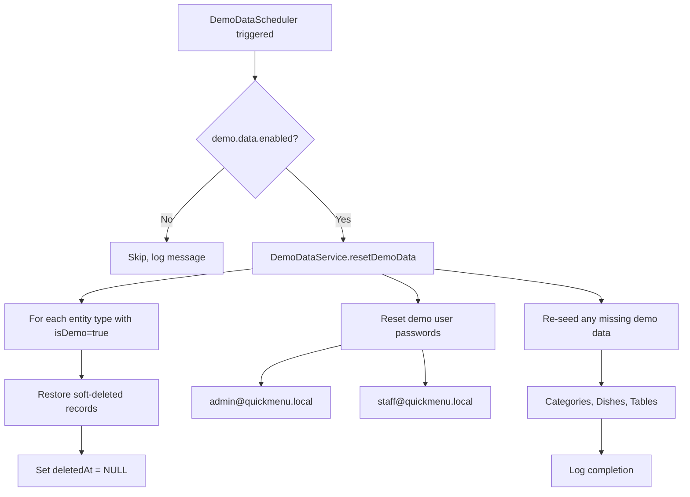

# QuickMenu Backend - Comprehensive 🍽️

> **Purpose**: An exhaustive, interview-focused deep dive into the QuickMenu backend codebase. This guide covers architecture, design patterns, critical interview questions, and detailed process flows.

---

## Table of Contents

1. [Project Summary](#1-project-summary)
2. [Modules and Logic Breakdown](#2-modules-and-logic-breakdown)
3. [Main Components (Interview Focus)](#3-main-components-interview-focus)
4. [Design Patterns Used](#4-design-patterns-used)
5. [Mock Interview Questions and Answers](#5-mock-interview-questions-and-answers)
6. [Detailed Project Process and Flow Layout](#6-detailed-project-process-and-flow-layout)
7. [Critical Interview Questions (Deep Dive)](#7-critical-interview-questions-deep-dive)

---

## 1. Project Summary

### What is QuickMenu?

**QuickMenu** is a **QR-based, real-time digital ordering platform** designed for restaurants. It enables:
- **Customers** to scan a table QR code → view menu → place orders without downloading any app
- **Staff** to receive live order and "ring-the-bell" notifications via WebSocket
- **Admins** to manage restaurants, menus, tables, staff, and view analytics

### Why This Project?

| Problem | Solution |
|---------|----------|
| Traditional menus are static and require reprinting | Digital menus with real-time availability updates |
| Customers struggle to get waiter attention | "Ring the Bell" feature for instant notifications |
| No visibility into restaurant performance | Admin dashboard with metrics, top dishes, hourly breakdown |
| Multiple apps/logins for customers | No customer login required - scan and order |
| Slow order processing | Real-time WebSocket for instant staff notifications |

### Tech Stack Overview

| Layer | Technology | Purpose |
|-------|------------|---------|
| **Framework** | Spring Boot 3.5.x (Java 21) | Modern REST API backend |
| **Security** | Spring Security + JWT | Stateless token-based authentication |
| **Database** | H2 (dev) / PostgreSQL (prod) | Relational data persistence |
| **ORM** | Spring Data JPA + Hibernate | Database abstraction |
| **Real-time** | Spring WebSocket + STOMP | Live order/bell notifications |
| **File Storage** | Cloudinary | Cloud image uploads |
| **Email** | SendGrid | Password reset emails |
| **QR Generation** | ZXing | Table QR code generation |
| **API Docs** | SpringDoc OpenAPI (Swagger) | Auto-generated API documentation |
| **Build** | Maven | Dependency management |

### Key Architectural Highlights

```
QuickMenu Backend Architecture
│
├── 🔐 Auth Module (JWT-based stateless auth)
│   ├── Roles: ROLE_ADMIN, ROLE_STAFF, ROLE_CUSTOMER
│   └── Password reset via email
│
├── 🍽️ Menu Module (Multi-tenant restaurant management)
│   ├── Restaurant → Tables → Categories → Dishes
│   └── Soft delete with @Where clause
│
├── 📦 Orders Module (Transactional order processing)
│   ├── Pessimistic locking on tables
│   ├── Cascade save for OrderItems
│   └── Real-time STOMP broadcast
│
├── 🔔 Bell Module (Customer → Staff notifications)
│   ├── Rate-limited (20s cooldown)
│   ├── Event persistence for analytics
│   └── WebSocket delivery
│
├── 📊 Admin Module (Dashboard & Metrics)
│   ├── Top dishes, revenue, hourly breakdown
│   └── Staff management
│
└── ⚙️ Infrastructure
    ├── GlobalExceptionHandler
    ├── CORS configuration
    ├── Demo data scheduler
    └── Cloudinary file uploads
```

---

## 2. Modules and Logic Breakdown

### 2.1 Authentication Module (`com.quickmenu.auth`)

**Location**: `src/main/java/com/quickmenu/auth/`

#### Key Files

| File | Purpose |
|------|---------|
| [User.java](file:///c:/Users/syntronic/Desktop/Sohail%20Resume%20Project/QuickMenu/backend/src/main/java/com/quickmenu/auth/model/User.java) | User entity with roles, soft delete |
| [Role.java](file:///c:/Users/syntronic/Desktop/Sohail%20Resume%20Project/QuickMenu/backend/src/main/java/com/quickmenu/auth/model/Role.java) | Enum: ROLE_ADMIN, ROLE_STAFF, ROLE_CUSTOMER |
| [JwtTokenProvider.java](file:///c:/Users/syntronic/Desktop/Sohail%20Resume%20Project/QuickMenu/backend/src/main/java/com/quickmenu/auth/security/JwtTokenProvider.java) | Token generation/validation |
| [JwtAuthenticationFilter.java](file:///c:/Users/syntronic/Desktop/Sohail%20Resume%20Project/QuickMenu/backend/src/main/java/com/quickmenu/auth/security/JwtAuthenticationFilter.java) | Request filter for JWT extraction |
| [AuthController.java](file:///c:/Users/syntronic/Desktop/Sohail%20Resume%20Project/QuickMenu/backend/src/main/java/com/quickmenu/auth/controller/AuthController.java) | Login, signup, password reset endpoints |

#### User Entity Design

```java
@Entity
@Where(clause = "deleted_at IS NULL")  // Soft delete filter
@Table(name = "users")
public class User {
    @Id
    @GeneratedValue(generator = "uuid2")
    private String id;  // UUID-based primary key
    
    private String email;           // Unique identifier for login
    private String passwordHash;    // BCrypt encrypted
    
    @Enumerated(EnumType.STRING)
    private Role role;              // ROLE_ADMIN, ROLE_STAFF, ROLE_CUSTOMER
    
    private String assignedRestaurantId;  // Multi-tenant binding
    private Boolean isDemo;               // Demo data flag
    private Instant deletedAt;            // Soft delete marker
}
```

#### JWT Flow Diagram



---

### 2.2 Menu Module (`com.quickmenu.menu`)

**Location**: `src/main/java/com/quickmenu/menu/`

#### Entity Relationships



#### Key Features

| Feature | Implementation |
|---------|---------------|
| **Soft Delete** | All entities use `@Where(clause = "deleted_at IS NULL")` |
| **UUID Primary Keys** | `@GeneratedValue(generator = "uuid2")` with Hibernate UUIDGenerator |
| **Multi-Tenancy** | `restaurantId` foreign key on all child entities |
| **QR Code Generation** | ZXing library for table QR URLs |
| **Demo Data Flag** | `isDemo` boolean for scheduled restoration |

#### TableRepository - Pessimistic Locking

```java
@Lock(LockModeType.PESSIMISTIC_WRITE)
@Query("select t from TableEntity t where t.id = :id")
Optional<TableEntity> findByIdForUpdate(@Param("id") String id);
```

> **Interview Point**: This prevents race conditions when multiple customers try to order at the same table simultaneously.

---

### 2.3 Orders Module (`com.quickmenu.orders`)

**Location**: `src/main/java/com/quickmenu/orders/`

#### Order Entity Design

```java
@Entity
@Where(clause = "deleted_at IS NULL")
public class Order {
    public enum Status {
        PLACED, PENDING, IN_PROGRESS, READY, SERVED, CANCELLED, PREPARING
    }
    
    @Id private String id;
    private String restaurantId;
    private String tableId;
    private String customerName;
    private String customerPhone;
    
    @Enumerated(EnumType.STRING)
    private Status status;
    
    // Formula for sorting: Active orders (0) before completed (1)
    @Formula("(CASE WHEN status IN ('PLACED','PENDING','IN_PROGRESS','PREPARING','READY') THEN 0 ELSE 1 END)")
    private int statusPriority;
    
    private BigDecimal totalAmount;
    
    @OneToMany(mappedBy = "order", cascade = CascadeType.ALL, fetch = FetchType.LAZY)
    private List<OrderItem> items;
}
```

#### Order Placement Flow (Critical Interview Topic)



#### OrderService - Transactional Processing

```java
@Transactional
public Map<String, Object> placeOrder(String restaurantId, OrderDto.CreateOrderRequest req) {
    // 1. Acquire pessimistic lock on table
    TableEntity table = tableRepository.findByIdForUpdate(req.getTableId())
            .orElseThrow(() -> new IllegalArgumentException("Invalid table"));
    
    // 2. Check if already occupied
    if (Boolean.TRUE.equals(table.getOccupied())) {
        throw new TableOccupiedException();
    }
    
    // 3. Mark as occupied
    table.setOccupied(true);
    tableRepository.save(table);
    
    // 4. Build order with items, cascade save
    Order order = Order.builder()
            .restaurantId(restaurantId)
            .tableId(req.getTableId())
            .items(items)
            .build();
    
    Order saved = orderRepository.save(order);
    
    // 5. Real-time broadcast
    messagingTemplate.convertAndSend("/topic/restaurants/" + restaurantId + "/orders", orderPayload);
    
    return orderPayload;
}
```

---

### 2.4 Bell Module (`com.quickmenu.bell`)

**Location**: `src/main/java/com/quickmenu/bell/`

#### BellEvent Entity

```java
@Entity
@Table(name = "bell_events", indexes = {
    @Index(name = "idx_bell_rest_status_created", columnList = "restaurant_id, status, created_at")
})
public class BellEvent {
    public enum Status { PENDING, ACKED, TIMEOUT }
    
    private String id;
    private String restaurantId;
    private String tableId;
    private String message;
    private String source;     // "QR", "WEB", "APP"
    private Status status;
    private Instant createdAt;
    private String ackBy;
    private Instant ackAt;
    private Boolean delivered;
    private Integer attempts;
}
```

#### Rate Limiting Implementation

```java
// In-memory cooldown map: key = restaurantId:tableId -> last event timestamp
private final Map<String, Instant> lastEventAt = new ConcurrentHashMap<>();

public BellEvent createBell(String restaurantId, String tableId, String message, String source) {
    String key = restaurantId + ":" + tableId;
    Instant now = Instant.now();
    Instant last = lastEventAt.get(key);
    
    // Rate limit check
    if (last != null && now.isBefore(last.plusSeconds(cooldownSeconds))) {
        throw new IllegalStateException("Too many bell requests. Please wait.");
    }
    
    // Persist and broadcast
    BellEvent saved = bellRepo.save(event);
    lastEventAt.put(key, now);  // Update cooldown
    
    messagingTemplate.convertAndSend("/topic/restaurants/" + restaurantId + "/bells", payload);
    return saved;
}
```

> **Interview Point**: Current implementation uses in-memory ConcurrentHashMap. For horizontal scaling, this should migrate to **Redis TTL-based distributed limiter**.

---

### 2.5 Admin Module (`com.quickmenu.admin`)

**Location**: `src/main/java/com/quickmenu/admin/`

#### AdminMetricsService - Analytics

```java
public MetricDtos.AdminMetricsResponse getMetrics(String restaurantId, Instant start, Instant end) {
    // 1. Top 5 dishes by quantity/revenue
    List<TopDishDto> topDishes = orderItemRepository.findTopDishesByRestaurant(restaurantId, start, end);
    
    // 2. Hourly order breakdown (native PostgreSQL query)
    List<Object[]> rows = orderRepository.hourlyOrdersBetween(restaurantId, start, end);
    
    // 3. Category statistics
    List<CategoryStatDto> catStats = orderItemRepository.findCategoryStatsByRestaurant(restaurantId, start, end);
    
    return new AdminMetricsResponse(topDishes, hourly, catStats);
}
```

#### Native Query for Hourly Aggregation

```sql
SELECT DATE_TRUNC('hour', placed_at) AS hour_start,
       COUNT(*) AS orders_count
FROM orders
WHERE restaurant_id = :restaurantId
  AND placed_at >= :start
  AND placed_at <= :end
GROUP BY DATE_TRUNC('hour', placed_at)
ORDER BY DATE_TRUNC('hour', placed_at) ASC
```

---

### 2.6 Configuration (`com.quickmenu.config`)

**Location**: `src/main/java/com/quickmenu/config/`

#### SecurityConfig - Complete Filter Chain

```java
@EnableMethodSecurity
@Configuration
public class SecurityConfig {
    
    @Bean
    public SecurityFilterChain securityFilterChain(HttpSecurity http) throws Exception {
        http
            .httpBasic(AbstractHttpConfigurer::disable)      // Disable Basic Auth
            .formLogin(AbstractHttpConfigurer::disable)      // Disable form login
            .cors(Customizer.withDefaults())                 // Enable CORS
            .csrf(AbstractHttpConfigurer::disable)           // Disable CSRF (stateless)
            .sessionManagement(session -> 
                session.sessionCreationPolicy(SessionCreationPolicy.STATELESS))
            .authorizeHttpRequests(auth -> auth
                // Public endpoints
                .requestMatchers("/api/auth/**", "/api/demo/**").permitAll()
                .requestMatchers(HttpMethod.GET, "/api/*/menu/**").permitAll()
                .requestMatchers(HttpMethod.POST, "/api/*/orders").permitAll()  // Customer orders
                .requestMatchers(HttpMethod.POST, "/api/restaurants/*/tables/*/bell").permitAll()
                
                // Protected endpoints
                .requestMatchers("/api/admin/**").hasRole("ADMIN")
                .requestMatchers("/api/**").authenticated()
                
                // WebSocket
                .requestMatchers("/websocket/**", "/ws/**").permitAll()
            )
            .exceptionHandling(ex -> ex
                .authenticationEntryPoint((req, res, e) -> 
                    res.setStatus(401))  // JSON 401 response
                .accessDeniedHandler((req, res, e) -> 
                    res.setStatus(403))  // JSON 403 response
            );
        
        http.addFilterBefore(jwtFilter, UsernamePasswordAuthenticationFilter.class);
        return http.build();
    }
}
```

#### WebSocketConfig - STOMP Configuration

```java
@Configuration
@EnableWebSocketMessageBroker
public class WebSocketConfig implements WebSocketMessageBrokerConfigurer {
    
    @Override
    public void configureMessageBroker(MessageBrokerRegistry registry) {
        registry.enableSimpleBroker("/topic", "/queue");  // In-memory broker
        registry.setApplicationDestinationPrefixes("/app");
    }
    
    @Override
    public void registerStompEndpoints(StompEndpointRegistry registry) {
        registry.addEndpoint("/websocket")      // Pure WebSocket
                .setAllowedOriginPatterns("*");
        
        registry.addEndpoint("/ws")              // SockJS fallback
                .setAllowedOriginPatterns("*")
                .withSockJS();
    }
}
```

---

### 2.7 Scheduler (`com.quickmenu.scheduler`)

**Location**: `src/main/java/com/quickmenu/scheduler/`

#### DemoDataScheduler

```java
@Component
@Scheduled(initialDelayString = "5000", 
           fixedRateString = "#{${demo.data.restore-interval-minutes:30} * 60000}")
public void restoreDemoData() {
    if (!demoDataEnabled) return;
    
    demoDataService.resetDemoData();  // Restore soft-deleted demo entities
}
```

> **Interview Point**: This ensures consistent demo state for recruiters/users by automatically restoring deleted demo data and resetting demo user passwords.

---

## 3. Main Components (Interview Focus)

### 3.1 JWT Authentication Flow

#### Token Generation

```java
public String generateToken(String userId, String email, Role role) {
    return Jwts.builder()
            .subject(userId)
            .claim("email", email)
            .claim("role", role.name())
            .issuedAt(new Date())
            .expiration(new Date(now.getTime() + expirationMs))
            .signWith(key)  // HMAC-SHA key
            .compact();
}
```

#### Token Validation

```java
public boolean validateToken(String token) {
    try {
        Jwts.parser().verifyWith(key).build().parseSignedClaims(token);
        return true;
    } catch (JwtException | IllegalArgumentException e) {
        return false;
    }
}
```

### 3.2 Real-time Order Broadcasting

#### WebSocket Topic Structure

```
/topic/restaurants/{restaurantId}/orders  → Order events
/topic/restaurants/{restaurantId}/bells   → Bell events
```

#### Broadcasting Pattern

```java
// Order placed
messagingTemplate.convertAndSend(
    "/topic/restaurants/" + restaurantId + "/orders",
    Map.of(
        "id", order.getId(),
        "tableId", order.getTableId(),
        "status", order.getStatus().toString(),
        "items", itemsWithDetails
    )
);
```

### 3.3 Specification Pattern for Dynamic Filtering

```java
public static Specification<Order> withFilters(
        String restaurantId, 
        Order.Status status, 
        Instant startDate, 
        Instant endDate) {
    
    return (root, query, cb) -> {
        List<Predicate> predicates = new ArrayList<>();
        
        predicates.add(cb.equal(root.get("restaurantId"), restaurantId));
        
        if (status != null) {
            predicates.add(cb.equal(root.get("status"), status));
        }
        if (startDate != null) {
            predicates.add(cb.greaterThanOrEqualTo(root.get("placedAt"), startDate));
        }
        if (endDate != null) {
            predicates.add(cb.lessThanOrEqualTo(root.get("placedAt"), endDate));
        }
        
        return cb.and(predicates.toArray(new Predicate[0]));
    };
}
```

### 3.4 Global Exception Handling

```java
@ControllerAdvice
public class GlobalExceptionHandler {
    
    @ExceptionHandler(IllegalArgumentException.class)
    public ResponseEntity<?> handleBadRequest(IllegalArgumentException ex) {
        return buildError(HttpStatus.BAD_REQUEST, ex.getMessage());
    }
    
    @ExceptionHandler(MethodArgumentNotValidException.class)
    public ResponseEntity<?> handleValidation(MethodArgumentNotValidException ex) {
        Map<String, String> errors = new HashMap<>();
        for (FieldError fe : ex.getBindingResult().getFieldErrors()) {
            errors.put(fe.getField(), fe.getDefaultMessage());
        }
        return ResponseEntity.badRequest().body(errors);
    }
    
    @ExceptionHandler(BadCredentialsException.class)
    public ResponseEntity<?> handleBadCredentials(BadCredentialsException ex) {
        return buildError(HttpStatus.UNAUTHORIZED, "Invalid username or password");
    }
}
```

---

## 4. Design Patterns Used

### 4.1 Repository Pattern

**Implementation**: Spring Data JPA repositories extending `JpaRepository`

```java
public interface OrderRepository extends JpaRepository<Order, String>, 
                                          JpaSpecificationExecutor<Order> {
    List<Order> findByRestaurantId(String restaurantId);
    Page<Order> findByRestaurantIdAndStatus(String restaurantId, Order.Status status, Pageable p);
}
```

**Benefits**:
- Abstracts database operations
- Provides pagination, sorting, and specification-based queries
- Reduces boilerplate code

---

### 4.2 Builder Pattern

**Implementation**: Lombok `@Builder` on all entities

```java
Order order = Order.builder()
        .restaurantId(restaurantId)
        .tableId(tableId)
        .customerName(customerName)
        .totalAmount(total)
        .status(Order.Status.PLACED)
        .build();
```

**Benefits**:
- Immutable object construction
- Clear, fluent API
- Avoids telescoping constructors

---

### 4.3 Specification Pattern

**Implementation**: JPA Criteria API for dynamic query building

```java
Specification<Order> spec = OrderSpecification.withFilters(restaurantId, status, startDate, endDate);
Page<Order> orders = orderRepository.findAll(spec, pageable);
```

**Benefits**:
- Composable query conditions
- Type-safe criteria building
- Separates filtering logic from repository

---

### 4.4 Filter Chain Pattern

**Implementation**: Spring Security filter chain with JWT filter

```java
http.addFilterBefore(jwtFilter, UsernamePasswordAuthenticationFilter.class);
```

**Flow**:
```
Request → JwtAuthenticationFilter → UsernamePasswordAuthenticationFilter → Controller
```

---

### 4.5 Observer Pattern (Pub/Sub)

**Implementation**: Spring WebSocket with STOMP messaging

```java
// Publisher
messagingTemplate.convertAndSend("/topic/restaurants/" + id + "/orders", payload);

// Subscriber (frontend)
stompClient.subscribe('/topic/restaurants/123/orders', callback);
```

**Benefits**:
- Decoupled real-time communication
- Scalable broadcast mechanism
- No polling required

---

### 4.6 Template Method Pattern

**Implementation**: Spring's `OncePerRequestFilter`

```java
public class JwtAuthenticationFilter extends OncePerRequestFilter {
    @Override
    protected void doFilterInternal(HttpServletRequest request,
                                    HttpServletResponse response,
                                    FilterChain filterChain) {
        // Token extraction and validation
        filterChain.doFilter(request, response);
    }
}
```

---

### 4.7 DTO Pattern

**Implementation**: Separate DTOs for request/response mapping

```java
public class OrderDto {
    @Data
    public static class CreateOrderRequest {
        private String tableId;
        private String customerName;
        private List<CreateOrderItem> items;
    }
    
    @Data
    public static class OrderResponse {
        private String id;
        private String status;
        private List<OrderItemResponse> items;
    }
}
```

**Benefits**:
- Decouples API contract from domain model
- Controls exposed data
- Enables versioning

---

### 4.8 Soft Delete Pattern

**Implementation**: Hibernate `@Where` clause

```java
@Entity
@Where(clause = "deleted_at IS NULL")
public class User {
    @Column(name = "deleted_at")
    private Instant deletedAt;
}
```

**Deletion Logic**:
```java
// Soft delete for demo data
if (entity.getIsDemo()) {
    entity.setDeletedAt(Instant.now());
    repository.save(entity);
} else {
    repository.delete(entity);  // Hard delete for real data
}
```

---

### 4.9 Cascade Pattern

**Implementation**: JPA `CascadeType.ALL` for parent-child relationships

```java
@OneToMany(mappedBy = "order", cascade = CascadeType.ALL, fetch = FetchType.LAZY)
private List<OrderItem> items;
```

**Behavior**: Saving Order automatically saves all OrderItems

---

### 4.10 Pessimistic Locking Pattern

**Implementation**: JPA `@Lock` for concurrency control

```java
@Lock(LockModeType.PESSIMISTIC_WRITE)
@Query("select t from TableEntity t where t.id = :id")
Optional<TableEntity> findByIdForUpdate(@Param("id") String id);
```

**Use Case**: Prevents race conditions when two customers try to order at the same table

---

## 5. Mock Interview Questions and Answers

### Beginner Level

#### Q1: What is this project about?

**Answer**: QuickMenu is a QR-based digital ordering system for restaurants. When customers scan a table's QR code, they can view the menu and place orders without logging in. Staff receive real-time notifications via WebSocket. The system supports multiple restaurants (multi-tenancy) with role-based access for admins and staff.

#### Q2: Why did you choose Spring Boot?

**Answer**: Spring Boot provides:
- Rapid development with auto-configuration
- Built-in security with Spring Security
- Easy integration with JPA for database operations
- Native WebSocket support for real-time features
- Extensive ecosystem (Swagger, Actuator, etc.)

#### Q3: How does authentication work?

**Answer**: We use stateless JWT authentication:
1. User logs in with email/password
2. Server validates credentials and returns a JWT token
3. Client includes token in `Authorization: Bearer <token>` header
4. [JwtAuthenticationFilter](file:///c:/Users/syntronic/Desktop/Sohail%20Resume%20Project/QuickMenu/backend/src/main/java/com/quickmenu/auth/security/JwtAuthenticationFilter.java#18-62) extracts and validates the token on each request
5. Token contains userId, email, and role claims

#### Q4: What database are you using?

**Answer**: H2 in-memory database for development (easy to reset) and PostgreSQL for production. The switch is controlled via Spring profiles in [application.yml](file:///c:/Users/syntronic/Desktop/Sohail%20Resume%20Project/QuickMenu/backend/src/main/resources/application.yml) and [application-prod.yml](file:///c:/Users/syntronic/Desktop/Sohail%20Resume%20Project/QuickMenu/backend/src/main/resources/application-prod.yml).

---

### Intermediate Level

#### Q5: How do you handle concurrent orders for the same table?

**Answer**: We use **pessimistic locking** with `@Lock(LockModeType.PESSIMISTIC_WRITE)`:

```java
@Lock(LockModeType.PESSIMISTIC_WRITE)
@Query("select t from TableEntity t where t.id = :id")
Optional<TableEntity> findByIdForUpdate(@Param("id") String id);
```

When [placeOrder()](file:///c:/Users/syntronic/Desktop/Sohail%20Resume%20Project/QuickMenu/backend/src/main/java/com/quickmenu/orders/controller/OrderController.java#33-64) is called:
1. We acquire an exclusive lock on the table row
2. Check if `occupied = false`
3. If occupied, throw `TableOccupiedException` (HTTP 409)
4. If free, set `occupied = true` and proceed

The lock is released when the transaction commits, preventing race conditions.

#### Q6: How does real-time notification work?

**Answer**: We use **STOMP over WebSocket**:

1. **Configuration**: [WebSocketConfig](file:///c:/Users/syntronic/Desktop/Sohail%20Resume%20Project/QuickMenu/backend/src/main/java/com/quickmenu/config/WebSocketConfig.java#7-32) sets up endpoints at `/websocket` (raw) and `/ws` (SockJS fallback)
2. **Topics**: 
   - `/topic/restaurants/{id}/orders` for order events
   - `/topic/restaurants/{id}/bells` for bell events
3. **Broadcasting**: `SimpMessagingTemplate.convertAndSend()` publishes events
4. **Subscription**: Frontend subscribes to topics using SockJS/STOMP client

#### Q7: How do you prevent bell spam?

**Answer**: We implement **in-memory rate limiting** in [BellService](file:///c:/Users/syntronic/Desktop/Sohail%20Resume%20Project/QuickMenu/backend/src/main/java/com/quickmenu/bell/service/BellService.java#16-120):

```java
private final Map<String, Instant> lastEventAt = new ConcurrentHashMap<>();

public BellEvent createBell(...) {
    String key = restaurantId + ":" + tableId;
    Instant last = lastEventAt.get(key);
    
    if (last != null && now.isBefore(last.plusSeconds(cooldownSeconds))) {
        throw new IllegalStateException("Too many requests");
    }
    
    // Proceed with bell creation
    lastEventAt.put(key, now);
}
```

Default cooldown is 20 seconds, configurable via `app.bell.cooldown-seconds`.

#### Q8: How is soft delete implemented?

**Answer**: Using Hibernate's `@Where` clause:

```java
@Entity
@Where(clause = "deleted_at IS NULL")
public class User {
    @Column(name = "deleted_at")
    private Instant deletedAt;
}
```

All queries automatically filter out soft-deleted records. Demo data is soft-deleted to allow scheduled restoration.

---

### Advanced Level

#### Q9: How would you scale the WebSocket implementation?

**Answer**: Current MVP uses an in-memory Simple Broker. For horizontal scaling:

1. **Replace with Redis Pub/Sub or RabbitMQ**: 
   - All server instances subscribe to a shared message broker
   - Messages are fanned out to all subscribers

2. **Sticky Sessions or Session Registry**:
   - Use a distributed session store (Redis)
   - Route WebSocket connections consistently

3. **Consider Kafka for high throughput**:
   - Persist events to Kafka topics
   - Consumers broadcast to connected clients

```java
// Example: Using Redis broker
@Configuration
public class WebSocketConfig {
    @Override
    public void configureMessageBroker(MessageBrokerRegistry registry) {
        registry.enableStompBrokerRelay("/topic", "/queue")
                .setRelayHost("redis-host")
                .setRelayPort(61613);
    }
}
```

#### Q10: How would you scale rate limiting?

**Answer**: Current in-memory `ConcurrentHashMap` doesn't work across instances. Solutions:

1. **Redis with TTL**:
   ```java
   String key = "bell:" + restaurantId + ":" + tableId;
   Boolean allowed = redisTemplate.opsForValue().setIfAbsent(key, "1", Duration.ofSeconds(20));
   if (!allowed) throw new RateLimitException();
   ```

2. **Token Bucket Algorithm** with Redis:
   - Store bucket state in Redis
   - Allow burst with refill rate

3. **Dedicated Rate Limiting Service** (e.g., Redis + Lua scripts)

#### Q11: Explain the Order entity's `@Formula` annotation

**Answer**: 
```java
@Formula("(CASE WHEN status IN ('PLACED','PENDING','IN_PROGRESS','PREPARING','READY') THEN 0 ELSE 1 END)")
private int statusPriority;
```

This is a **computed property** evaluated at query time:
- Active orders (PLACED, PENDING, etc.) get priority `0`
- Completed orders (SERVED, CANCELLED) get priority `1`

Used for sorting: `Sort.by(Sort.Direction.ASC, "statusPriority")` ensures active orders appear first in the staff dashboard.

**Why not use Java sorting?**: Formula pushes computation to the database, enabling efficient pagination without loading all records into memory.

#### Q12: How do you handle multi-tenancy?

**Answer**: We use a **discriminator column approach**:

1. Every entity has a `restaurantId` field
2. All queries include `restaurantId` as a filter
3. Users are bound to restaurants via `assignedRestaurantId`

```java
@Query("SELECT o FROM Order o WHERE o.restaurantId = :restaurantId AND o.status = :status")
Page<Order> findByRestaurantIdAndStatus(...);
```

**Enforcement**:
- API paths include `/{restaurantId}/...`
- Services validate restaurant ownership on sensitive operations
- `@PreAuthorize` checks role + restaurant access

---

## 6. Detailed Project Process and Flow Layout

### 6.1 Customer Order Flow (End-to-End)



---

### 6.2 Staff Order Management Flow



---

### 6.3 Bell (Ring-the-Bell) Flow



---

### 6.4 Admin Analytics Flow



---

### 6.5 Demo Data Reset Flow



---

## 7. Critical Interview Questions (Deep Dive)

### Database & ORM

#### Q1: Why use UUID for primary keys instead of auto-increment?

**Answer**:
1. **Distributed systems**: UUIDs are globally unique without coordination
2. **Security**: Harder to guess/enumerate than sequential IDs
3. **Merge conflicts**: Avoids collisions when syncing databases
4. **URL safety**: UUIDs work well in URLs without encoding

**Trade-offs**:
- Larger storage (36 chars vs 4-8 bytes for int)
- No implicit ordering (use `createdAt` for sorting)
- Index fragmentation (consider UUID v7 for time-ordered UUIDs)

---

#### Q2: Why use `BigDecimal` for prices instead of `double`?

**Answer**:
```java
private BigDecimal price;
private BigDecimal totalAmount;
```

`double` has **floating-point precision issues**:
```java
0.1 + 0.2 = 0.30000000000000004  // Wrong!
```

`BigDecimal` provides **exact decimal arithmetic**:
```java
new BigDecimal("0.1").add(new BigDecimal("0.2")) = 0.3  // Correct!
```

Essential for financial calculations where precision matters.

---

#### Q3: Explain the `@Formula` annotation usage

**Answer**:
```java
@Formula("(CASE WHEN status IN ('PLACED','PENDING','IN_PROGRESS','PREPARING','READY') THEN 0 ELSE 1 END)")
private int statusPriority;
```

**Properties**:
- **Read-only computed column** (not stored in DB)
- **Evaluated at query time** by the database
- **Enables database-level sorting** without loading all records

**Use case**: Sort active orders before completed ones without custom comparators.

---

### Security

#### Q4: How do you protect against JWT token theft?

**Answer**: Current MVP mitigations:
1. **Short expiration** (1 hour): `jwt.expirationMs: 3600000`
2. **HTTPS only** (production): Prevents interception
3. **httpOnly cookies** (future): Prevents XSS access

**Future enhancements**:
1. **Refresh tokens**: Short-lived access token + long-lived refresh token
2. **Token rotation**: New token on each refresh
3. **Token revocation**: Store revoked tokens in Redis with TTL
4. **Device binding**: Include device fingerprint in token claims

---

#### Q5: Why disable CSRF protection?

**Answer**:
```java
.csrf(AbstractHttpConfigurer::disable)
```

CSRF protection is for **cookie-based session authentication**. Our API uses:
- **Stateless JWT** in Authorization header
- **No cookies** for authentication
- **Same-origin** requests from SPA

CSRF attacks exploit browser's automatic cookie inclusion, which doesn't apply to header-based tokens.

---

#### Q6: How do you prevent SQL injection?

**Answer**: Multiple layers of protection:

1. **Parameterized queries** (JPA/Hibernate):
   ```java
   @Query("SELECT o FROM Order o WHERE o.id = :orderId")
   Optional<Order> findById(@Param("orderId") String orderId);
   ```

2. **Spring Data JPA method naming**:
   ```java
   List<Order> findByRestaurantIdAndStatus(String restaurantId, Order.Status status);
   ```

3. **Criteria API for dynamic queries**:
   ```java
   cb.equal(root.get("status"), status)  // Type-safe, no string concatenation
   ```

4. **Input validation** (`@Valid`, `@NotBlank`, etc.)

---

### Concurrency & Performance

#### Q7: What happens if [findByIdForUpdate](file:///c:/Users/syntronic/Desktop/Sohail%20Resume%20Project/QuickMenu/backend/src/main/java/com/quickmenu/menu/repo/TableRepository.java#36-39) throws a deadlock?

**Answer**: PostgreSQL (and most databases) will wait for the lock with a timeout, then throw an exception if the lock isn't acquired.

**Handling**:
```java
@Transactional(timeout = 5)  // 5 second timeout
public Map<String, Object> placeOrder(...) {
    try {
        TableEntity table = tableRepository.findByIdForUpdate(tableId);
        // ...
    } catch (PessimisticLockingFailureException e) {
        throw new TryAgainException("Please try again");
    }
}
```

**Prevention**:
- Keep transactions short
- Acquire locks in consistent order
- Use `PESSIMISTIC_READ` when possible

---

#### Q8: How would you optimize the hourly aggregation query for large datasets?

**Answer**: Current query:
```sql
SELECT DATE_TRUNC('hour', placed_at) AS hour_start, COUNT(*)
FROM orders
WHERE restaurant_id = :restaurantId
  AND placed_at BETWEEN :start AND :end
GROUP BY DATE_TRUNC('hour', placed_at)
```

**Optimizations**:

1. **Indexing**:
   ```sql
   CREATE INDEX idx_orders_rest_placed ON orders(restaurant_id, placed_at);
   ```

2. **Materialized views** (for dashboards):
   ```sql
   CREATE MATERIALIZED VIEW hourly_order_stats AS
   SELECT restaurant_id, DATE_TRUNC('hour', placed_at) AS hour,
          COUNT(*) AS order_count
   FROM orders
   GROUP BY restaurant_id, DATE_TRUNC('hour', placed_at);
   
   REFRESH MATERIALIZED VIEW CONCURRENTLY hourly_order_stats;
   ```

3. **Pre-aggregation**: Store hourly/daily summaries in separate tables

4. **Caching**: Cache frequently accessed date ranges in Redis

---

### Architecture & Design

#### Q9: Why persist BellEvents instead of just broadcasting?

**Answer**:
1. **Audit trail**: Know who rang when
2. **Analytics**: Track response times (createdAt → ackAt)
3. **SLA metrics**: Measure staff performance
4. **Retry mechanism**: Redeliver if WebSocket fails
5. **Historical queries**: "Show all bells from yesterday"

```java
BellEvent {
    createdAt;   // When customer rang
    ackAt;       // When staff acknowledged
    ackBy;       // Who acknowledged
    delivered;   // WebSocket delivery status
    attempts;    // Retry count
}
```

---

#### Q10: How would you implement multi-restaurant support with tenant isolation?

**Current Approach**: Discriminator column (`restaurantId` on all entities)

**Alternative Approaches**:

1. **Schema per tenant**:
   ```java
   @TenantId
   private String tenantId;
   
   // Hibernate intercepts and routes to correct schema
   ```

2. **Database per tenant**:
   ```java
   @Qualifier("tenant-{tenantId}")
   DataSource getDataSource(String tenantId);
   ```

3. **Row-level security (PostgreSQL)**:
   ```sql
   ALTER TABLE orders ENABLE ROW LEVEL SECURITY;
   CREATE POLICY tenant_isolation ON orders
   FOR ALL TO app_user
   USING (restaurant_id = current_setting('app.restaurant_id'));
   ```

**Trade-offs**:
| Approach | Isolation | Complexity | Performance |
|----------|-----------|------------|-------------|
| Discriminator | Low | Low | Best |
| Schema/tenant | Medium | Medium | Good |
| DB/tenant | High | High | Overhead |

---

#### Q11: Explain the difference between `cascade = CascadeType.ALL` and manual saves

**Answer**:

**With Cascade**:
```java
@OneToMany(mappedBy = "order", cascade = CascadeType.ALL)
private List<OrderItem> items;

// Single save persists Order + all Items
orderRepository.save(order);
```

**Without Cascade**:
```java
Order savedOrder = orderRepository.save(order);
for (OrderItem item : items) {
    item.setOrder(savedOrder);
    orderItemRepository.save(item);
}
```

**Benefits of Cascade**:
- Atomic operation (all-or-nothing)
- Less code
- Automatic orphan removal with `orphanRemoval = true`

**Risks**:
- Accidental deletions (cascade delete)
- Performance with large collections
- Harder to debug

---

### Error Handling

#### Q12: How do you ensure consistent error responses?

**Answer**: [GlobalExceptionHandler](file:///c:/Users/syntronic/Desktop/Sohail%20Resume%20Project/QuickMenu/backend/src/main/java/com/quickmenu/config/GlobalExceptionHandler.java#20-88) with `@ControllerAdvice`:

```java
@ControllerAdvice
public class GlobalExceptionHandler {
    
    private ResponseEntity<Map<String, Object>> buildError(HttpStatus status, String message) {
        return ResponseEntity.status(status).body(Map.of(
            "timestamp", Instant.now().toString(),
            "status", status.value(),
            "error", status.getReasonPhrase(),
            "message", message
        ));
    }
    
    @ExceptionHandler(IllegalArgumentException.class)
    public ResponseEntity<?> handleBadRequest(IllegalArgumentException ex) {
        return buildError(HttpStatus.BAD_REQUEST, ex.getMessage());
    }
    
    @ExceptionHandler(BadCredentialsException.class)
    public ResponseEntity<?> handleBadCredentials(BadCredentialsException ex) {
        return buildError(HttpStatus.UNAUTHORIZED, "Invalid username or password");
    }
}
```

**Consistent format across all endpoints**:
```json
{
    "timestamp": "2024-01-15T10:30:00Z",
    "status": 400,
    "error": "Bad Request",
    "message": "Customer name is required"
}
```

---

### Testing & Quality

#### Q13: How would you test the order placement flow?

**Answer**: Multi-layer testing approach:

1. **Unit Tests** (Service layer):
   ```java
   @Test
   void placeOrder_whenTableOccupied_throwsException() {
       when(tableRepository.findByIdForUpdate("t1"))
           .thenReturn(Optional.of(occupiedTable));
       
       assertThrows(TableOccupiedException.class,
           () -> orderService.placeOrder("r1", request));
   }
   ```

2. **Integration Tests** (MockMvc):
   ```java
   @SpringBootTest
   @AutoConfigureMockMvc
   class OrderControllerIT {
       @Test
       void placeOrder_success() throws Exception {
           mockMvc.perform(post("/api/r1/orders")
                   .contentType(MediaType.APPLICATION_JSON)
                   .content(orderJson))
               .andExpect(status().isCreated())
               .andExpect(jsonPath("$.id").exists());
       }
   }
   ```

3. **WebSocket Tests**:
   ```java
   @Test
   void orderBroadcast_receivedBySubscriber() {
       StompSession session = connectToWebSocket();
       session.subscribe("/topic/restaurants/r1/orders", handler);
       
       orderService.placeOrder("r1", request);
       
       await().atMost(5, SECONDS).until(() -> handler.receivedMessage());
   }
   ```

---

### Future Improvements

#### Q14: What would you change if you had more time?

**Answer**:

1. **Authentication**:
   - Add refresh tokens
   - OAuth2 social login
   - httpOnly cookies for web clients

2. **Scalability**:
   - Redis for rate limiting
   - Redis/RabbitMQ for WebSocket scaling
   - Kafka for event sourcing

3. **Performance**:
   - Query caching with Redis
   - Pre-computed analytics tables
   - Database read replicas

4. **Testing**:
   - JUnit test suite
   - Contract tests with Pact
   - Load testing with Gatling

5. **Observability**:
   - Distributed tracing (Jaeger/Zipkin)
   - Metrics (Micrometer + Prometheus)
   - Structured logging (JSON format)

6. **Features**:
   - Payment integration
   - Kitchen display system
   - Inventory management
   - Reservation system

---

## Quick Reference Card

### API Endpoints Summary

| Method | Endpoint | Access | Purpose |
|--------|----------|--------|---------|
| POST | `/api/auth/signup` | Public | Register user |
| POST | `/api/auth/login` | Public | Login, get JWT |
| POST | `/api/auth/forgot-password` | Public | Request reset email |
| POST | `/api/auth/reset-password` | Public | Reset password |
| GET | `/api/{rid}/menu` | Public | Get menu |
| POST | `/api/{rid}/orders` | Public | Place order |
| POST | `/api/restaurants/{rid}/tables/{tid}/bell` | Public | Ring bell |
| GET | `/api/{rid}/orders` | Staff/Admin | List orders |
| PATCH | `/api/{rid}/orders/{oid}` | Staff/Admin | Update status |
| GET | `/api/admin/stats` | Admin | Analytics |
| POST | `/api/admin/restore-demo-data` | Admin | Reset demo |

### WebSocket Topics

| Topic | Events |
|-------|--------|
| `/topic/restaurants/{id}/orders` | ORDER_CREATED, STATUS_CHANGED |
| `/topic/restaurants/{id}/bells` | BELL_CREATED, BELL_ACKED |

### Key Configuration

| Property | Default | Purpose |
|----------|---------|---------|
| `jwt.secret` | (required) | JWT signing key |
| `jwt.expirationMs` | 3600000 | Token expiry (1hr) |
| `app.bell.cooldown-seconds` | 20 | Bell rate limit |
| `demo.data.enabled` | true | Enable demo reset |
| `demo.data.restore-interval-minutes` | 30 | Reset frequency |

---

> **Pro Tip**: When explaining any feature, always mention:
> 1. **Why** the decision was made
> 2. **Trade-offs** considered
> 3. **Future improvements** if scaling
