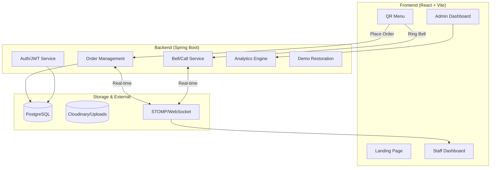

# 🍽️ QuickMenu: QR-Based Real-Time Restaurant Management

QuickMenu is a sophisticated, full-stack digital ordering platform designed to modernize the dining experience. By leveraging QR-code technology, real-time WebSockets, and a robust micro-service inspired architecture, it provides a seamless flow from customer ordering to staff fulfillment and admin analytics.

---

## 🏗️ Architecture Overview

The system is built as a modular monorepo with a clear separation between the high-performance Spring Boot backend and the dynamic React frontend.

---

## 🛠️ Tech Stack

### Backend
- **Core:** Java 21, Spring Boot 3.5.x
- **Security:** Spring Security + JWT (Stateless Authentication)
- **Data:** Spring Data JPA, PostgreSQL (Production) / H2 (Dev)
- **Real-time:** Spring WebSocket + STOMP
- **API Documentation:** Springdoc OpenAPI (Swagger UI)
- **Utils:** Lombok, Google ZXing (QR Generation), SendGrid (Email), Cloudinary (Images)

### Frontend
- **Core:** React 19, TypeScript, Vite
- **Styling:** Tailwind CSS 3.4
- **State Management:** Zustand
- **Routing:** React Router 7
- **Visuals:** Lucide React (Icons), Recharts (Analytics)
- **Networking:** Axios, @stomp/stompjs

---

## ✨ Key Features

### 👤 For Customers (No App Required)
- **Scan & View:** Instant access to the digital menu via table-specific QR codes.
- **Direct Ordering:** Add items to cart and place orders without waiting for a server.
- **Ring the Bell:** Notify staff for water, bill, or assistance instantly.
- **Order Tracking:** Live status updates for placed orders.

### 👩‍🍳 For Staff
- **Real-time Order Feed:** Instant notifications when new orders are placed.
- **Bell Management:** Acknowledgment flow for customer call events.
- **Order Fulfillment:** Ability to update order status (Confirm, Done, etc.).

### 📊 For Admins
- **Analytics Dashboard:** Deep dive into revenue, order volume, and top-performing dishes.
- **Menu Management:** Dynamic control over categories, dishes, and availability.
- **Restaurant Onboarding:** Manage restaurant metadata, address, and branding.
- **QR Generator:** Automatic generation of table-specific QR codes.

---

## 🧪 Demo Excellence Features

QuickMenu includes specific features to maintain a clean demo environment for recruiters and visitors:

- **Soft Delete Pattern:** Demo data is never permanently deleted; it's marked with a timestamp.
- **Auto-Restoration Scheduler:** A background task runs every 30 minutes to restore the demo environment to its pristine state.
- **Role-Based Demo Logins:** One-click login options for both Admin and Staff roles to explore the dashboard immediately.

---

## 🚀 Getting Started

### Prerequisites
- JDK 21+
- Node.js 18+
- Maven 3.9+

### Backend Setup
1. Navigate to `/backend`
2. Copy `.env.example` to `.env` and configure your database/API keys.
3. Run: `./mvnw spring-boot:run`

### Frontend Setup
1. Navigate to `/frontend`
2. Copy `.env.example` to `.env`
3. Run: `npm install && npm run dev`

---

## 🌐 API Endpoints Summary

| Endpoint | Method | Role | Description |
|----------|--------|------|-------------|
| `/api/auth/login` | POST | ALL | Authenticate and get JWT |
| `/api/restaurants` | POST | ADMIN | Create new restaurant |
| `/api/{rid}/dishes` | GET | ALL | Fetch restaurant menu |
| `/api/{rid}/orders` | POST | ALL | Place a new order |
| `/api/admin/metrics` | GET | ADMIN | Fetch analytics data |
| `/api/{rid}/bells` | POST | ALL | Ring table bell |

---

## 📸 UI Showcase

*Admin Dashboard with Real-time Analytics*

*Interactive QR Menu for Customers*

