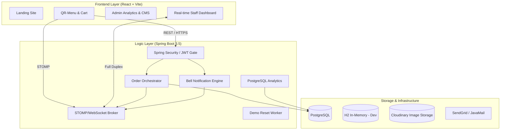

# 🍽️ QuickMenu: High-Performance Digital Ordering Ecosystem

QuickMenu is a full-stack, real-time restaurant management platform designed to eliminate the friction between customers and service staff. Built with a modular monorepo architecture, it showcases modern engineering practices in **Spring Boot (Java 21)** and **React 19**.

---

## �️ System Architecture Deep Dive

The architecture follows a decoupled, event-driven-ready design, ensuring high availability and low latency for critical restaurant operations.



### � Security Architecture
- **Stateless JWT Flow:** Implemented a custom `JwtAuthenticationFilter` that intercepts requests, validates RSA-signed tokens, and populates the `SecurityContext`.
- **Role-Based Access Control (RBAC):** Using `@PreAuthorize` annotations across controllers to strictly enforce `ADMIN`, `STAFF`, and `CUSTOMER` roles.
- **Credential Safety:** Passwords are salted and hashed using **BCrypt** (10+ rounds) before persistence.

### 🔔 Real-time Notification Engine
- **STOMP over WebSockets:** Leveraged `Spring WebSocket` with the STOMP protocol to provide full-duplex communication.
- **Dynamic Topics:** Orders and Bell alerts are published to unique restaurant-scoped topics (e.g., `/topic/restaurants/{id}/orders`), ensuring data isolation.

### 🧵 Concurrency & Data Integrity
- **Pessimistic Locking:** Using `@Lock(LockModeType.PESSIMISTIC_WRITE)` in the [TableRepository](backend/src/main/java/com/quickmenu/menu/repo/TableRepository.java) to prevent race conditions during table check-ins and order placement.
- **Transactional Consistency:** Critical business logic in [OrderService](backend/src/main/java/com/quickmenu/orders/service/OrderService.java) is wrapped in `@Transactional` to ensure atomicity across Order items and Table state updates.

---

## 🛠️ Technical Stack & Tooling

### Backend (The Robust Engine)
- **Framework:** Spring Boot 3.5.x (Java 21 - Records, Virtual Threads ready)
- **Data Persistence:** Spring Data JPA + Hibernate (Auto-mapping to Postgres/H2)
- **Documentation:** [Swagger UI](backend/src/main/resources/static/openapi.yaml) via Springdoc for interactive API testing.
- **Utilities:** 
    - **Lombok:** Boilerplate reduction.
    - **ZXing:** QR algorithm for table-specific code generation.
    - **Cloudinary:** Efficient multipart image handling for restaurant banners and dish photos.

### Frontend (The Dynamic Hub)
- **Framework:** React 19 + TypeScript (Enforcing strict typing)
- **State Orchestration:** 
    - **Zustand:** Used for lightweight global state (Auth, UI toggles). *Rationale: Significant reduction in boilerplate compared to Redux, while providing better performance than Context API for frequent updates.*
- **Data Fetching:** Axios with custom interceptors for JWT injection and centralized error handling.
- **Data Visualization:** **Recharts** for real-time sales and performance monitoring.

---

## ✨ Engineering Features

### 🏢 Multi-User Role Workflows
- **Recruiter-Friendly Logins:** Specialized [Login Page](frontend/src/pages/Auth/Login.tsx) logic that pre-fills demo credentials to allow immediate exploration of Admin/Staff features.
- **QR Generator:** Integrated QR code generation that maps a physical table ID to a unique restaurant menu URL, enabling the "Scan-to-Order" flow.

### 🏗️ Demo Integrity & Soft Deletes
- **Logic:** Demo entities are marked with `deletedAt` rather than dropped from the DB.
- **The Worker:** A [Scheduled Task](backend/src/main/java/com/quickmenu/scheduler/DemoDataScheduler.java) resets the environment every 30 minutes, ensuring the project remains presentable to every user without manual intervention.

---

## ⚖️ Trade-offs & Decisions

| Feature | Decision | Rationale |
|---------|----------|-----------|
| **DB Performance** | H2 for Dev, Postgres for Prod | Speed of development vs. relational reliability at scale. |
| **Real-time** | Simple In-Memory Broker | Optimized for single-server latency; avoids complexity of External MQ (like RabbitMQ) for early-stage MVP. |
| **State** | Zustand | Prioritized simplicity and developer velocity while maintaining reactive UI performance. |
| **Images** | Multipart -> Cloudinary | Offloaded heavy binary storage from the DB to a specialized CDN, improving response times. |

---

## 🚀 Future Roadmap

- **Microservices Shift:** Decouple the monolithic Order service into a separate high-throughput service.
- **Distributed Caching:** Integrate **Redis** to handle WebSocket session management and rate-limiting for Bell events.
- **Payment Integration:** Stripe/Razorpay integration for unified digital payments at the table.
- **AI Insights:** Automated "Popular Item" recommendations based on historical order clusters.

---

## � Setup & Development

Refer to the individual [Backend README](backend/Readme.md) and [Frontend README](frontend/README.md) for detailed configuration options.

### Quick Monorepo Start
```bash
# Terminal 1: Backend
cd backend && ./mvnw spring-boot:run

# Terminal 2: Frontend
cd frontend && npm install && npm run dev
```
