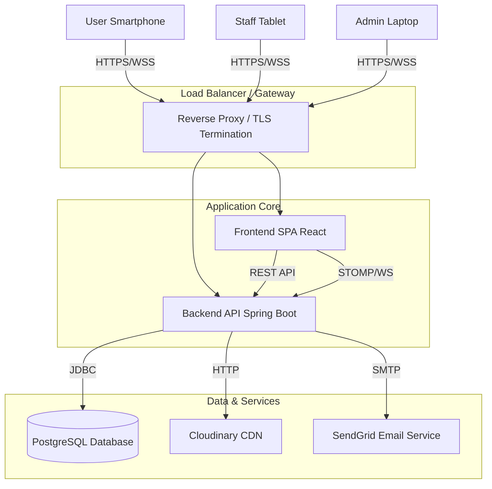
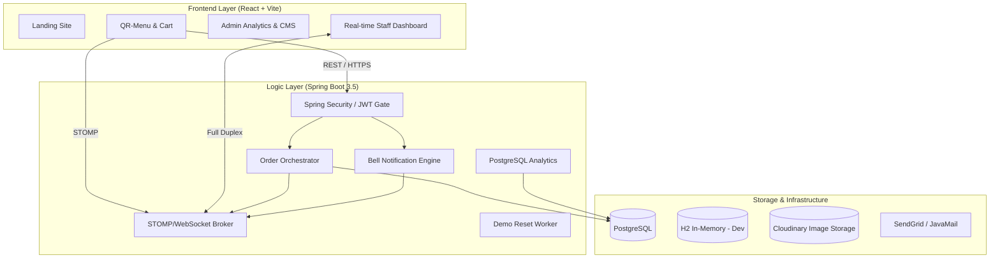

# 📖 QuickMenu: The Complete Developer Handbook & System Architecture

> **Version:** 2.0.0  
> **Status:** Production / Demo Ready  
> **Maintainer:** Sohail  
> **License:** MIT  

---

# 📚 Table of Contents

1. [📖 Project Overview](#-project-overview)
    - [The Business Problem](#the-business-problem)
    - [The Solution](#the-solution)
    - [Key Features Matrix](#key-features-matrix)
2. [🏗️ System Architecture](#-system-architecture)
    - [High-Level Diagram](#high-level-diagram)
    - [Container Diagram](#container-diagram)
    - [Monorepo Structure](#monorepo-structure)
3. [⚙️ Backend Ecosystem (Spring Boot)](#-backend-ecosystem-spring-boot)
    - [Core Framework](#core-framework)
    - [Security & Authentication (JWT)](#security--authentication-jwt)
    - [Real-Time Messaging (WebSocket/STOMP)](#real-time-messaging-websocketstomp)
    - [Service Layer Deep Dive](#service-layer-deep-dive)
        - [Order Orchestration](#order-orchestration)
        - [Bell Notification System](#bell-notification-system)
    - [Data Access & Persistence](#data-access--persistence)
4. [🎨 Frontend Ecosystem (React + Vite)](#-frontend-ecosystem-react--vite)
    - [Technology Choice](#technology-choice)
    - [Component Architecture](#component-architecture)
    - [State Management (Zustand)](#state-management-zustand)
    - [Critical Flows](#critical-flows)
        - [Server Wake-up Logic](#server-wake-up-logic)
        - [Optimistic UI Patterns](#optimistic-ui-patterns)
5. [💾 Database & Data Integrity](#-database--data-integrity)
    - [Entity Relationship Diagram (ERD)](#entity-relationship-diagram-erd)
    - [Soft Delete Mechanism](#soft-delete-mechanism)
    - [Demo Data Restoration](#demo-data-restoration)
6. [🔌 API Reference](#-api-reference)
    - [Authentication](#authentication)
    - [Restaurant Management](#restaurant-management)
    - [Menu Operations](#menu-operations)
    - [Ordering System](#ordering-system)
7. [🚀 Deployment & Operations](#-deployment--operations)
    - [Local Development Setup](#local-development-setup)
    - [Production Build](#production-build)
    - [Environment Variables](#environment-variables)
8. [🔮 Future Roadmap & Technical Debt](#-future-roadmap--technical-debt)

---

# 📖 Project Overview

## The Business Problem
Traditional dining experiences often suffer from friction points:
- **Wait Times:** Customers waiting for menus, waiters to take orders, or the bill.
- **Communication Gaps:** Difficulty signalling staff in busy or loud environments.
- **Static Content:** Printed menus cannot reflect real-time availability or price changes.
- **Operational Blindness:** Owners lack real-time visibility into current service load or instantaneous revenue.

## The Solution
**QuickMenu** is a "Phygital" (Physical + Digital) solution that bridges the gap using QR codes. It is a full-stack platform that empowers:
- **Customers** to self-serve (Scan -> Order -> Eat).
- **Staff** to receive instant table alerts (Orders, Bell rings).
- **Admins** to manage multiple restaurants and view aggregate analytics.

## Key Features Matrix

| Feature | Role | Description | Tech Implementation |
|:---|:---|:---|:---|
| **Scan-to-Order** | Customer | Instant menu access without app download. | Dynamic Routing `react-router`, URL params |
| **Real-time Order Feed** | Staff | Orders appear instantly on kitchen dashboard. | `WebSocket`, `STOMP` over `SockJS` |
| **Digital Bell** | Customer | "Call Waiter" button with rate limiting. | `Redis` (planned) / `ConcurrentHashMap` (current) |
| **Menu Management** | Admin | Create dishes, categories, upload images. | `Cloudinary` SDK, `Spring Data JPA` |
| **Analytics Dashboard** | Admin | Visual charts of revenue and item popularity. | `Recharts`, Native SQL Aggregation |
| **Demo Mode** | Public | Auto-resetting data for recruiters. | Spring `@Scheduled` Task, `Soft Deletes` |

---

# 🏗️ System Architecture

## High-Level Diagram
The system follows a classic **Client-Server** model but enhanced with **Event-Driven** capabilities for real-time features.



## 🏗️ Project Architecture Deep Dive

The architecture follows a decoupled, event-driven-ready design, ensuring high availability and low latency for critical restaurant operations.



## Container Diagram

1.  **Web Client (Single Page Application)**
    -   **Tech:** React 19, Vite, TypeScript, TailwindCSS.
    -   **Responsibility:** Rendering UI, handling user interactions, maintaining local session state (JWT), establishing WebSocket connections.
    -   **Deploy Target:** Vercel / Netlify (Static Hosting).

2.  **API Server**
    -   **Tech:** Java 21, Spring Boot 3.5.0.
    -   **Responsibility:** Business logic, authentication, data validation, websocket message brokerage, scheduled maintenance.
    -   **Deploy Target:** Render / Railway / AWS EC2.

3.  **Database**
    -   **Tech:** PostgreSQL 15 (Production), H2 (Development).
    -   **Responsibility:** Persistent storage of relational data (Users, Restaurants, Orders).

## Monorepo Structure

The project is structured as a monorepo to keep full-stack context in one place, easing development and refactoring.

```text
QuickMenu/
├── backend/                  # Spring Boot Application
│   ├── src/main/java/com/quickmenu/
│   │   ├── admin/            # Admin Analytics & Dashboard Logic
│   │   ├── auth/             # JWT, User, Security Config
│   │   ├── bell/             # Bell/Notification Feature
│   │   ├── config/           # Global Config (CORS, Swagger, WS)
│   │   ├── menu/             # Restaurant, Dish, Category domains
│   │   ├── orders/           # Order processing & State machine
│   │   └── scheduler/        # Cron jobs (Demo Reset)
│   ├── pom.xml               # Maven Dependencies
│   └── .env.example          # Backend Environment Template
│
├── frontend/                 # React Application
│   ├── src/
│   │   ├── app/              # Zustand Store definitions
│   │   ├── components/       # Reusable UI Blocks (Buttons, Modals)
│   │   ├── lib/              # Utilities (API client, Date formatting)
│   │   ├── pages/            # Route Views (Admin, Menu, Auth)
│   │   └── routes/           # Route Definitions
│   ├── package.json          # Node Dependencies
│   └── vite.config.ts        # Build Configuration
│
└── infra/                    # Infrastructure / Docker / K8s (Future)
```

---

# ⚙️ Backend Ecosystem (Spring Boot)

The backend is built with **Robustness** and **Scalability** in mind, leveraging the latest features of Java 21 and Spring Boot 3.5.

## Core Framework
-   **Spring Boot 3.5.x:** Utilizing the latest auto-configuration capabilities.
-   **Java 21:** Leveraging features like `Records` for DTOs and Pattern Matching for `instanceof` checks.
-   **Lombok:** Reducing boilerplate code (Getters, Setters, Builders, Slf4j).

## Security & Authentication (JWT)

Security is implemented using a stateless JWT (JSON Web Token) architecture. This ensures that the backend can scale horizontally without sticky sessions.

### The Security Filter Chain (`SecurityConfig.java`)

1.  **Request Arrival:** Every HTTP request passes through the `SecurityFilterChain`.
2.  **Public Endpoints:** `/api/auth/**`, GET `/api/{rid}/menu`, and WebSocket endpoints are whitelisted using `.permitAll()`.
3.  **JWT Filter (`JwtAuthenticationFilter`):**
    -   Extracts the `Authorization: Bearer <token>` header.
    -   Validates the signature using the secret key.
    -   Parses claims (User ID, Role, Email).
    -   Creates a `UsernamePasswordAuthenticationToken` and places it in the `SecurityContextHolder`.
4.  **Authorization:** Endpoints annotated with `@PreAuthorize("hasRole('ADMIN')")` are checked against the context authorities.
5.  **Exception Handling:** Custom `AuthenticationEntryPoint` returns standard JSON 401/403 errors instead of default HTML pages.

**Code Highlight: Stateless Session Policy**
```java
http.sessionManagement(session -> 
    session.sessionCreationPolicy(SessionCreationPolicy.STATELESS)
);
```

## Real-Time Messaging (WebSocket/STOMP)

QuickMenu uses WebSockets to push updates to the Staff Dashboard immediately.

### Configuration (`WebSocketConfig.java`)
-   **Broker:** Simple In-Memory Broker active on `/topic` and `/queue`.
-   **Endpoints:**
    -   `/ws`: SockJS fallback endpoint (for browsers).
    -   `/websocket`: Raw WebSocket endpoint (for debug tools like Postman).
-   **Allowed Origins:** Configured to allow cross-origin connections from the frontend domain.

### Message Flow
1.  **Frontend Subscribe:** Staff client subscribes to `/topic/restaurants/{id}/orders`.
2.  **Event Trigger:** Customer places order via POST `/api/{rid}/orders`.
3.  **Processing:** `OrderService` saves order to DB.
4.  **Publish:** `SimpMessagingTemplate.convertAndSend()` pushes the order DTO to the topic.
5.  **Reception:** All connected staff clients receive the JSON payload and update the React state.

## Service Layer Deep Dive

### Order Orchestration (`OrderService.java`)
The heart of the application. It handles the lifecycle of an order: `PLACED` -> `PREPARING` -> `READY` -> `SERVED` -> `PAID`.

**Critical Logic: Concurrency Control**
To prevent two customers from booking the same last-available item or table simultaneously (though strictly tables here), we use **Pessimistic Locking**.

```java
// Logic inside placeOrder transaction
TableEntity table = tableRepository.findByIdForUpdate(req.getTableId())
    .orElseThrow(() -> new IllegalArgumentException("Invalid table"));

if (table.getOccupied()) {
    throw new TableOccupiedException("Table is already busy!");
}
table.setOccupied(true);
```
*Why Pessimistic?* For a restaurant table, correctness (preventing double seating) is more critical than raw throughput.

### Bell Notification System (`BellService.java`)
Allows customers to signal staff.

**Rate Limiting Strategy:**
To prevent a child from spamming the bell button and flooding the staff dashboard:
-   **Mechanism:** `ConcurrentHashMap<String, Instant> lastEventAt`
-   **Key:** `restaurantId:tableId`
-   **Logic:** If `now()` is less than `lastEvent + 20 seconds`, the request is rejected with `429 Too Many Requests`.
-   **Trade-off:** In-memory map clears on server restart. For persistent rate limiting across multiple server instances, we would move this to **Redis**.

## Data Access & Persistence
-   **Spring Data JPA:** Repository interfaces for standard CRUD.
-   **Specifications:** Used for complex dynamic filtering (e.g., finding orders by date range AND status AND search term).
-   **Database:**
    -   **Dev:** H2 In-Memory (auto-creates tables).
    -   **Prod:** PostgreSQL (schema validation).

---

# 🎨 Frontend Ecosystem (React + Vite)

The frontend is a modern, responsive SPA designed for mobile-first usage (Customers) and desktop-first usage (Admin/Staff).

## Technology Choice
-   **Vite:** Chosen for its lightning-fast HMR (Hot Module Replacement) and optimized build times compared to CRA/Webpack.
-   **TypeScript:** Essential for maintaining sanity in a codebase with complex data models (Orders, Dishes, Auth).
-   **TailwindCSS:** Utility-first styling allowing rapid UI development without context switching to CSS files.

## Component Architecture
Components are split into `Atomic` (buttons, inputs) and `Molecular` (cards, forms) structures.

-   **`pages/`**: Route handlers (e.g., `RestaurantMenu.tsx`, `AdminDashboard.tsx`).
-   **`components/`**: Reusable blocks.
    -   `DishCard.tsx`: Displays image, price, title.
    -   `CartFloating.tsx`: The sticky cart bar for mobile users.
    -   `OrderSummaryModal.tsx`: The checkout experience.

## State Management (Zustand)
We chose **Zustand** over Redux Toolkit or Context API.
-   **Why?**
    -   **Simplicity:** No boilerplate (reducers, actions, providers).
    -   **Performance:** Selectors allow components to subscribe to only specific slices of state.
    -   **Decoupling:** State logic (`useAuthStore`) is separate from UI components.

**Store: `useAuthStore.ts`**
Manages the JWT token and decodes it to know the current user's role.
```typescript
// Auto-decoding logic on token set
setToken: (token) => {
    if (token) {
        localStorage.setItem('qm_token', token);
        const decoded = jwtDecode(token); // Custom decode utility
        set({ token, user: decoded });
    }
}
```

## Critical Flows

### Server Wake-up Logic (`RestaurantMenu.tsx`)
Since the demo runs on a free-tier hosting (Render) that spins down inactive instances:
1.  **Detection:** If an API call fails or times out initially.
2.  **UI Feedback:** A friendly "Waking up server..." animation appears.
3.  **Polling:** The frontend doesn't aggressively poll but encourages the user to wait while the backend cold-starts.

### Optimistic UI Patterns
In `BellButton.tsx`:
1.  User clicks "Ring Bell".
2.  UI immediately shows "Sending...".
3.  On success, button turns yellow/green.
4.  On rate-limit (429), it shows a specific "Wait a moment" error message.

---

# 💾 Database & Data Integrity

## Entity Relationship Diagram (ERD)

-   **Restaurant** (1) ↔ (N) **Table**
-   **Restaurant** (1) ↔ (N) **Category**
-   **Category** (1) ↔ (N) **Dish**
-   **Restaurant** (1) ↔ (N) **Order**
-   **Order** (1) ↔ (N) **OrderItem**
-   **Table** (1) ↔ (N) **BellEvent**

## Soft Delete Mechanism
To preserve data integrity (accounting, history) even when items are "deleted":
-   **Backend:** Entities have a `deletedAt` timestamp.
-   **Hibernate:** Global `@Where(clause = "deleted_at IS NULL")` ensures "deleted" items are invisible to normal queries.
-   **Admin:** Specific "Include Deleted" queries can be written if needed for audit logs.

## Demo Data Restoration
A unique feature for a portfolio project.
-   **Problem:** Recruiters/Users constantly modify data (delete dishes, change names), ruining the demo for the next person.
-   **Solution:** `DemoDataScheduler.java`
-   **Interval:** Every 30 minutes.
-   **Action:**
    1.  Finds all entities belonging to the "Demo Restaurant".
    2.  Resets their names/prices to defaults.
    3.  Restores soft-deleted items.
    4.  Cleans up old "test" orders to keep the dashboard snappy.

---

# 🔌 API Reference

Base URL: `/api`

## Authentication
| Method | Endpoint | Description | Auth Required |
|:---|:---|:---|:---|
| POST | `/auth/signup` | Register new user (Admin/Customer) | No |
| POST | `/auth/login` | Login and retrieve JWT | No |
| POST | `/auth/forgot-password` | Initiate password reset email | No |

## Restaurant Management
| Method | Endpoint | Description | Auth Required |
|:---|:---|:---|:---|
| GET | `/restaurants` | List all restaurants | No |
| POST | `/restaurants` | Create a new restaurant | **Admin** |
| PATCH | `/restaurants/{id}` | Update settings (Currency, Timezone) | **Admin** |

## Menu Operations
| Method | Endpoint | Description | Auth Required |
|:---|:---|:---|:---|
| GET | `/{id}/dishes` | Get full menu (grouped by category) | No |
| POST | `/{id}/dishes` | Add new dish | **Admin** |
| PATCH | `/{id}/dishes/{did}/availability` | Toggle In-Stock/Out-of-Stock | **Staff/Admin** |

## Ordering System
| Method | Endpoint | Description | Auth Required |
|:---|:---|:---|:---|
| POST | `/{id}/orders` | Place a new order | No (Public Table QR) |
| GET | `/{id}/orders` | Staff Order Feed (WebSocket backed) | **Staff** |
| PATCH | `/{id}/orders/{oid}` | Update Status (Serving/Served/Paid) | **Staff** |

---

# 🚀 Deployment & Operations

## Local Development Setup

### prereqs
-   JDK 21
-   Node.js 18+
-   Maven

### Step 1: Backend
```bash
cd backend
# Optional: Edit src/main/resources/application.yml for DB credentials if not using H2
./mvnw clean spring-boot:run
# Server starts at http://localhost:8080
```

### Step 2: Frontend
```bash
cd frontend
# Create .env file
echo "VITE_API_URL=http://localhost:8080" > .env
npm install
npm run dev
# App starts at http://localhost:5173
```

## Production Build

### Backend (Docker/Jar)
```bash
./mvnw package -DskipTests
java -jar target/quickmenu-0.0.1-SNAPSHOT.jar
```
*Note: Ensure `SPRING_PROFILES_ACTIVE=prod` is set to use PostgreSQL.*

### Frontend (Static)
```bash
npm run build
# Serve the /dist folder using Nginx, Vercel, or S3
```

## Environment Variables

### Backend
| Variable | Default | Description |
|:---|:---|:---|
| `SPRING_DATASOURCE_URL` | jdbc:h2:mem:db | Database URL (Postgres in prod) |
| `APP_JWT_SECRET` | (random) | 256-bit Key for signing tokens |
| `CLOUDINARY_URL` | - | Image upload credentials |
| `SENDGRID_API_KEY` | - | Email service key |

### Frontend
| Variable | Description |
|:---|:---|
| `VITE_API_URL` | Backend API Base URL (e.g., https://api.quickmenu.com) |

---

# 🔮 Future Roadmap & Technical Debt

While QuickMenu is feature-complete for a V1, we have identified areas for evolution.

## 1. Scalability: From Monolith to Microservices
-   **Current:** `OrderService` handles everything.
-   **Future:** Split `NotificationService` (Bell/Email) into a separate microservice listening to Kafka topics. This allows the notification system to scale independently of the ordering traffic.

## 2. Caching Strategy
-   **Current:** Database hits for every menu load.
-   **Future:** Implement `Redis` cache for `GET /menu`. Menu data changes rarely but is read frequently (Read-Heavy workload).

## 3. Resilience
-   **Current:** In-memory rate limiting.
-   **Future:** Distributed rate limiting using Redis (Token Bucket algorithm) to protect against DDoS attacks on the Bell API.

## 4. Analytics
-   **Current:** SQL Aggregation on the live transactional DB.
-   **Future:** ETL pipeline to move completed orders to a Data Warehouse (Snowflake/BigQuery) for expensive queries, keeping the OLTP database lean.

---

> **QuickMenu** — *Bridging the gap between the kitchen and the customer.*
