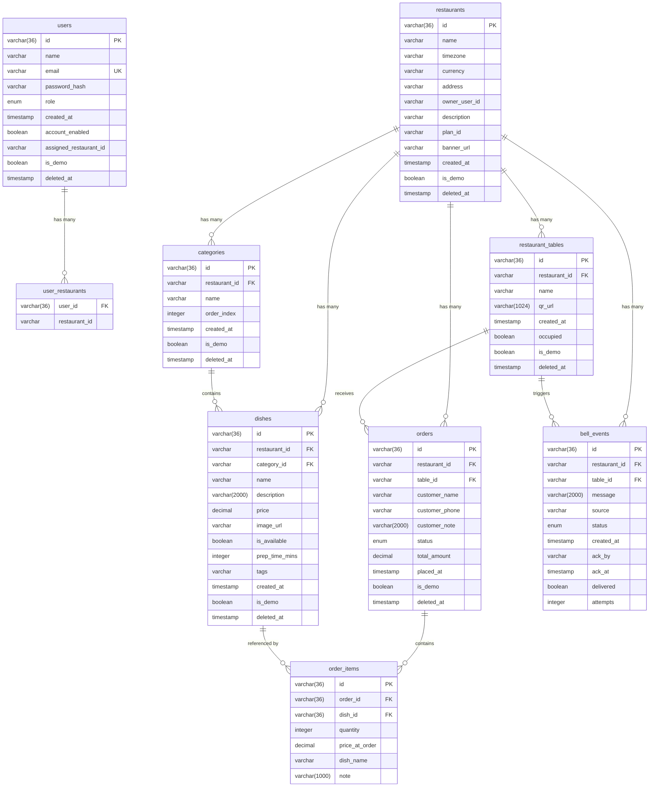

# QuickMenu Database Schema

## Entity Relationship Diagram

## Tables Overview

| Table | Purpose |
|-------|---------|
| `users` | Admin, Staff, Customer accounts |
| `restaurants` | Restaurant profiles owned by admins |
| `restaurant_tables` | Physical tables with QR codes |
| `categories` | Menu categories (Starters, Mains, etc.) |
| `dishes` | Menu items with prices |
| `orders` | Customer orders |
| `order_items` | Line items linking orders ↔ dishes |
| `bell_events` | "Call Waiter" button events |

## Foreign Key Relationships

| Parent | Child | FK Column |
|--------|-------|-----------|
| `users` | `user_restaurants` | `user_id` |
| `restaurants` | `restaurant_tables` | `restaurant_id` |
| `restaurants` | `categories` | `restaurant_id` |
| `restaurants` | `dishes` | `restaurant_id` |
| `restaurants` | `orders` | `restaurant_id` |
| `categories` | `dishes` | `category_id` |
| `orders` | `order_items` | `order_id` ✔ |
| `dishes` | `order_items` | `dish_id` ✔ |

## Enums

### `Role` (users.role)
- `ROLE_ADMIN`, `ROLE_STAFF`, `ROLE_CUSTOMER`

### `Order.Status` (orders.status)
- `PLACED`, `PENDING`, `IN_PROGRESS`, `PREPARING`, `READY`, `SERVED`, `CANCELLED`

### `BellEvent.Status` (bell_events.status)
- `PENDING`, `ACKED`, `TIMEOUT`

## Soft Deletes

All major entities use `deleted_at` column with `@Where(clause = "deleted_at IS NULL")` for soft delete filtering.

## Demo Data

All entities have `is_demo` boolean for identifying seed data.
